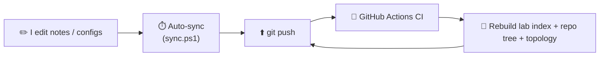

<div align="center">

# 🌐 CCNP ENCOR 350-401 — Lab Portfolio & Study Guide

### My hands-on journey to the **Cisco Certified Network Professional — Enterprise Core**
*Built entirely in EVE-NG · documented in public · automated with CI/CD*

<br/>


</div>

---

## 📖 About this repository

This is my **public study record** for the Cisco CCNP ENCOR (350-401 v1.2) exam — not just notes, but a working portfolio. Every lab is built and verified on **real Cisco CLI** in EVE-NG, documented with the exact verification commands and expected output, and mapped back to the official exam blueprint. The repo itself runs an **auto-sync and a GitHub Actions pipeline**, so it doubles as a small demonstration of the DevOps practices I use day to day.

> **What makes this different from a notes dump:** real CLI (not a simulator), verification-driven lab docs, blueprint-mapped coverage, and automation around the whole thing.

---

## 🎯 Exam blueprint & progress — ENCOR v1.2

> ENCOR moved to **v1.2 on 19 Mar 2026**. Wireless coverage was reduced and **Automation rose to 15%**. This portfolio tracks the v1.2 blueprint.

**Overall readiness: 🟨 ~12%**

| # | Domain | Weight | Progress |
|---|--------|:------:|:--------:|
| 1.0 | Architecture | 15% | ⬜ 0% |
| 2.0 | Virtualization | 10% | 🟨 20% |
| 3.0 | **Infrastructure** | 30% | 🟨 35% |
| 4.0 | Network Assurance | 10% | ⬜ 0% |
| 5.0 | Security | 20% | ⬜ 0% |
| 6.0 | Automation & AI | 15% | ⬜ 0% |

`⬜ not started · 🟨 in progress · 🟩 solid` — to update, just change the emoji and number. Detailed tracker → [`PROGRESS.md`](PROGRESS.md)

---

## 🗺️ Current lab topology

> 🔁 This topology **evolves as the labs progress** — the section below auto-updates from the latest lab via CI.

<!-- TOPOLOGY:START -->
**Currently shown: [Lab 07 — Advanced OSPF: Multi-Area, Stub, NSSA, Virtual-Links, Redistribution](labs/lab-07-ospf-advanced/)**

```
                            [ R7 ]  OSPF 100
                          10.1.7.7
                              |  (P2P)
                          10.1.7.1
           R1 ASBR              e0/1
  (OSPF 10 <-> 100)            [ R1 ]  pri=0
                            10.0.0.1
                                |
  [ R6 ]                   [== SW1 ==]                      [ R9 ]  OSPF 900
192.168.x.x               /    |     \                    10.5.9.9
  10.2.6.6            10.0.0.2 10.0.0.3 10.0.0.4             |  (P2P)
     |  (P2P)           /      |        \                 10.5.9.5
  10.2.6.2         [ R2 ]   [ R3 ]    [ R4 ]              e0/1
   e0/1           pri=100  pri=80    pri=50              [ R5 ]  ASBR
  [ R2 ] ABR       (DR)    (BDR)       |  e0/1          10.3.5.5
  area 26          e0/1     e0/1    10.4.8.4                |  (P2P)
  STUB           10.2.6.2 10.3.5.3     |  (P2P)        10.3.5.3
                 area 26  area 35   10.4.8.8              e0/1
                 STUB     NSSA       [ R8 ] ---- 10.8.10.8    [ R3 ] ABR
                                   area 48  (P2P)  area 108   area 35
                           R4 e0/2      |         10.8.10.10  NSSA
                         10.4.11.4   VL: R4<->R8  [ R10 ]
                              |      VL: R8<->R10  VL to area 0
                          10.4.11.11
                           [ R11 ]
                          area 411
                       TOTALLY STUB
                        (OSPF 100)
```

## Addressing

| Device | Interface | IP | Area | OSPF Process | Role |
|--------|-----------|------|------|:------------:|------|
| R1 | e0/0 | 10.0.0.1/24 | 0 | 10 | Backbone (pri 0, never DR) |
| R1 | e0/1 | 10.1.7.1/24 | 0 | 100 | ASBR link to R7 |
| R1 | Lo1 | 1.1.1.1/32 | — | — | Router ID |
| R2 | e0/0 | 10.0.0.2/24 | 0 | 10 | Backbone (pri 100, DR) |
| R2 | e0/1 | 10.2.6.2/24 | 26 | 10 | ABR → stub area |
| R2 | Lo1 | 2.2.2.2/32 | — | — | Router ID |
| R3 | e0/0 | 10.0.0.3/24 | 0 | 10 | Backbone (pri 80, BDR) |
| R3 | e0/1 | 10.3.5.3/24 | 35 | 10 | ABR → NSSA |
| R3 | Lo1 | 3.3.3.3/32 | — | — | Router ID |
| R4 | e0/0 | 10.0.0.4/24 | 0 | 10 | Backbone (pri 50) |
| R4 | e0/1 | 10.4.8.4/24 | 48 | 10 | ABR, virtual-link to R8 |
| R4 | e0/2 | 10.4.11.4/24 | 411 | 100 | ASBR → totally stub |
| R4 | Lo1 | 4.4.4.4/32 | — | — | Router ID |
| R5 | e0/0 | 10.3.5.5/24 | 35 | 10 | NSSA internal + ASBR |
| R5 | e0/1 | 10.5.9.5/24 | 0 | 900 | Link to R9 (separate OSPF) |
| R5 | Lo100-102 | 172.16.x.5/32 | 35 | 10 | Advertised in NSSA |
| R5 | Lo1 | 5.5.5.5/32 | — | — | Router ID |
| R6 | e0/0 | 10.2.6.6/24 | 26 | 10 | Stub internal |
| R6 | Lo100-102 | 192.168.x.6/32 | 26 | 10 | Advertised in stub |
| R6 | Lo1 | 6.6.6.6/32 | — | — | Router ID |
| R7 | e0/0 | 10.1.7.7/24 | 0 | 100 | Separate OSPF domain |
| R7 | Lo100-102 | 10.10.x.7/32 | 17 | 100 | OSPF 100 area 17 |
| R7 | Lo1 | 7.7.7.7/32 | — | — | Router ID |
| R8 | e0/0 | 10.4.8.8/24 | 48 | 10 | VL to R4 + R10 |
| R8 | e0/1 | 10.8.10.8/24 | 108 | 10 | VL transit to R10 |
| R8 | Lo100-102 | 192.168.20x.8/32 | 48 | 10 | Advertised in area 48 |
| R8 | Lo1 | 8.8.8.8/32 | — | — | Router ID |
| R9 | e0/0 | 10.5.9.9/24 | 0 | 900 | Separate OSPF domain |
| R9 | Lo1 | 9.9.9.9/32 | — | — | Router ID |
| R10 | e0/0 | 10.8.10.10/24 | 108 | 10 | VL to area 0 via R8 |
| R10 | Lo100-102 | 192.168.21x.10/32 | 48 | 10 | Advertised in area 48 |
| R10 | Lo1 | 10.10.10.10/32 | — | — | Router ID |
| R11 | e0/0 | 10.4.11.11/24 | 411 | 100 | Totally stub internal |
| R11 | Lo1 | 11.11.11.11/32 | — | — | Router ID |

---

*Each lab folder documents its own topology, so the full history stays intact as the network grows.*
<!-- TOPOLOGY:END -->

---

## 🗂️ Repository structure

> `weeks/` = weekly journal · `notes/` = study notes by ENCOR domain · `labs/` = full lab writeups · `lab-environment/` = EVE-NG & IOU setup. The tree below is auto-generated by CI.

<!-- REPO-TREE:START -->
```
CCNP-ENCOR-Preparation/
├── .github/
│   └── workflows/
├── lab-environment/
│   ├── eve-ng/
│   └── iou-web/
├── labs/
│   ├── lab-01-vlan-trunk/
│   ├── lab-02-inter-vlan-routing/
│   ├── lab-03-static-routing/
│   ├── lab-04-eigrp-pbr-ipsla/
│   ├── lab-05-vrf-lite/
│   ├── lab-06-ospf-multi-area/
│   └── lab-07-ospf-advanced/
├── notes/
│   ├── 01-architecture/
│   ├── 02-virtualization/
│   ├── 03-infrastructure/
│   ├── 04-network-assurance/
│   ├── 05-security/
│   └── 06-automation/
├── tools/
│   └── update_index.py
├── weeks/
│   ├── week-01/
│   ├── week-02/
│   ├── week-03/
│   ├── week-04/
│   ├── week-05/
│   ├── week-06/
│   └── week-07/
├── .gitignore
├── .markdownlint.json
├── PROGRESS.md
└── README.md
```
<!-- REPO-TREE:END -->

---

## 🧪 Labs

Each lab folder is self-contained: **objective → topology → addressing → config → verification (with expected output) → troubleshooting → blueprint mapping.**

<!-- LAB-INDEX:START -->
| Lab | Domain |
|-----|--------|
| [Lab 01 — Basic VLAN Configuration + 802.1Q Trunk](labs/lab-01-vlan-trunk/) | 3.0 Infrastructure → Layer 2 (VLANs, trunking, 802.1Q) |
| [Lab 02 - Inter-VLAN Routing (Router-on-a-Stick)](labs/lab-02-inter-vlan-routing/) | 3.0 Infrastructure |
| [Lab 03 — Static Routing with Path Control](labs/lab-03-static-routing/) | 3.0 Infrastructure |
| [Lab 04 — EIGRP + Policy-Based Routing + IP SLA Tracking](labs/lab-04-eigrp-pbr-ipsla/) | 3.0 Infrastructure |
| [Lab 05 — VRF Lite (Virtual Routing and Forwarding)](labs/lab-05-vrf-lite/) | 2.0 Virtualization |
| [Lab 06 — Multi-Area OSPF](labs/lab-06-ospf-multi-area/) | 3.0 Infrastructure |
| [Lab 07 — Advanced OSPF: Multi-Area, Stub, NSSA, Virtual-Links, Redistribution](labs/lab-07-ospf-advanced/) | 3.0 Infrastructure |
<!-- LAB-INDEX:END -->

*↑ This table is regenerated automatically by CI whenever a lab is added.*

---

## 🛠️ Lab environment

| Tool | Use | Details |
|------|-----|---------|
|  | Primary topology builder | [`lab-environment/eve-ng/`](lab-environment/eve-ng/) |
|  | Quick CLI drills & verification | [`lab-environment/iou-web/`](lab-environment/iou-web/) |

> Cisco IOSv-L2 / IOU / qcow2 images are licensed binaries and are **never** committed here — only my own configs, topologies, and docs.

---

## ⚙️ How this repo works (automation)



- **Auto-sync** — `scripts/sync.ps1` runs via Task Scheduler: rebase, commit, push. I just edit; the repo keeps itself current.
- **CI pipeline** — `.github/workflows/ci.yml` regenerates the lab index, repo tree, and topology section on every push.

---

## 🗓️ Roadmap to Q4 2026

| Phase | Focus | Domains |
|-------|-------|---------|
| ✅ Done | L2 — VLANs, trunking, inter-VLAN routing | 3.0 |
| ✅ Done | L3 — Static routing, path control | 3.0 |
| ✅ Done | L3 — EIGRP, PBR, IP SLA tracking | 3.0 |
| ✅ Done | Virtualization — VRF Lite | 2.0 |
| 🟢 **Now** | L3 — OSPF, BGP, redistribution | 3.0 |
| ⬜ Next | STP, EtherChannel, NAT, IP services | 3.0 / 4.0 |
| ⬜ | Security — ACLs, CoPP, AAA, hardening | 5.0 |
| ⬜ | Architecture — enterprise design, fabric | 1.0 |
| ⬜ | Automation & AI — Python, JSON/YAML, EEM, REST | 6.0 |
| 🎯 | Practice exams ≥ 85% · book Pearson VUE | All |

---

## 🎓 Credentials


%C2%B2-CISSP%20exam%20passed-00563F?style=flat-square)


---

## 🤝 Connect

[](https://linkedin.com/in/ahnaf-shariar-meraz)
[](https://medium.com/@ahnafshariar482)

---

<div align="center">

*This repo documents my own work. Configurations and notes are mine; Cisco IOS/IOU images are not included.*
**⭐ Star it to follow the journey to CCNP.**

</div>
