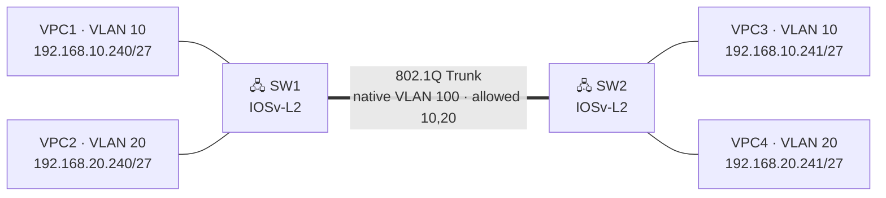
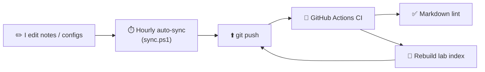

<div align="center">

# 🌐 CCNP ENCOR 350-401 — Lab Portfolio & Study Guide

### My hands-on journey to the **Cisco Certified Network Professional — Enterprise Core**
*Built entirely in EVE-NG · documented in public · automated with CI/CD*

<br/>


</div>

---

## 📖 About this repository

This is my **public study record** for the Cisco CCNP ENCOR (350-401 v1.2) exam — not just notes, but a working portfolio. Every lab is built and verified on **real Cisco CLI** in EVE-NG, documented with the exact verification commands and expected output, and mapped back to the official exam blueprint. The repo itself runs an **hourly auto-sync and a GitHub Actions pipeline**, so it doubles as a small demonstration of the DevOps practices I use day to day.

> **What makes this different from a notes dump:** real CLI (not a simulator), verification-driven lab docs, blueprint-mapped coverage, and automation around the whole thing.

---

## 🎯 Exam blueprint & progress — ENCOR v1.2

> ENCOR moved to **v1.2 on 19 Mar 2026**. Wireless coverage was reduced and **Automation rose to 15%**. This portfolio tracks the v1.2 blueprint.

| # | Domain | Weight | Progress | Status |
|---|--------|:------:|----------|:------:|
| 1.0 | Architecture | `15%` | `░░░░░░░░░░` 0% | ⬜ |
| 2.0 | Virtualization | `10%` | `░░░░░░░░░░` 0% | ⬜ |
| 3.0 | **Infrastructure** | `30%` | `▓▓░░░░░░░░` 20% | 🟨 |
| 4.0 | Network Assurance | `10%` | `░░░░░░░░░░` 0% | ⬜ |
| 5.0 | Security | `20%` | `░░░░░░░░░░` 0% | ⬜ |
| 6.0 | Automation & AI | `15%` | `░░░░░░░░░░` 0% | ⬜ |

**Overall readiness** `▓░░░░░░░░░` ~6% · detailed tracker → [`PROGRESS.md`](PROGRESS.md)

---

## 🗺️ Base lab topology



| Device | Role | Key configuration |
|--------|------|-------------------|
| **SW1 / SW2** | IOSv-L2 switches | `e0/0` 802.1Q trunk · native VLAN 100 · allowed 10,20 |
| **VPC1–4** | End hosts | VLAN 10 / 20 · `/27` subnets |

*This base topology is fixed; future labs extend it without changing the core.*

---

## 🗂️ Repository structure

```
ccnp-encor-portfolio/
├── README.md                 ← you are here
├── PROGRESS.md               ← study tracker (domains · labs · weekly log)
│
├── weeks/                    ← weekly study record
│   └── week-01/
│       ├── README.md         ← what I covered + review notes
│       └── configs/          ← device configs captured that week
│
├── notes/                    ← study notes by v1.2 blueprint domain
│   ├── 01-architecture/
│   ├── 02-virtualization/
│   ├── 03-infrastructure/
│   ├── 04-network-assurance/
│   ├── 05-security/
│   └── 06-automation/
│
├── labs/                     ← documented, verified hands-on labs
│   └── lab-01-vlan-trunk/
│
├── lab-environment/          ← how the lab is built
│   ├── eve-ng/               ← node types + .unl topology exports
│   └── iou-web/              ← IOU Web console workflow
│
├── scripts/sync.ps1          ← hourly auto-sync (Windows)
├── tools/update_index.py     ← auto-generates the lab index below
└── .github/workflows/ci.yml  ← lint + index pipeline
```

---

## 🧪 Labs

Each lab folder is self-contained: **objective → topology → addressing → config → verification (with expected output) → troubleshooting → blueprint mapping.**

<!-- LAB-INDEX:START -->
| Lab | Domain |
|-----|--------|
| [Lab 01 — Basic VLAN Configuration + 802.1Q Trunk](labs/lab-01-vlan-trunk/) | 3.0 Infrastructure → Layer 2 (VLANs, trunking, 802.1Q) |
<!-- LAB-INDEX:END -->

*↑ This table is regenerated automatically by CI whenever a lab is added — see below.*

---

## 🛠️ Lab environment

| Tool | Use | Details |
|------|-----|---------|
|  | Primary topology builder | [`lab-environment/eve-ng/`](lab-environment/eve-ng/) |
|  | Quick CLI drills & verification | [`lab-environment/iou-web/`](lab-environment/iou-web/) |

> Cisco IOSv-L2 / IOU / qcow2 images are licensed binaries and are **never** committed here — only my own configs, topologies, and docs.

---

## ⚙️ How this repo works (automation)



- **Auto-sync** — `scripts/sync.ps1` runs hourly via Task Scheduler: rebase, commit, push. I just edit; the repo keeps itself current.
- **CI pipeline** — `.github/workflows/ci.yml` lints Markdown and regenerates the lab index on every push.

---

## 🗓️ Roadmap to Q4 2026

| Phase | Focus | Domains |
|-------|-------|---------|
| 🟢 **Now** | L2 — VLANs, trunking, STP, EtherChannel | 3.0 |
| ⬜ Next | L3 — OSPF, BGP, redistribution, NAT | 3.0 |
| ⬜ | Network assurance + IP services | 3.0 / 4.0 |
| ⬜ | Security — ACLs, CoPP, AAA, hardening | 5.0 |
| ⬜ | Virtualization + Architecture | 1.0 / 2.0 |
| ⬜ | Automation & AI — Python, JSON/YAML, EEM, REST | 6.0 |
| 🎯 | Practice exams ≥ 85% · book Pearson VUE | All |

---

## 🎓 Credentials


---

## 🤝 Connect

> _Replace the `#` links with your profiles before publishing._

[](#)
[](#)

---

<div align="center">

*This repo documents my own work. Configurations and notes are mine; Cisco IOS/IOU images are not included.*
**⭐ Star it to follow the journey to CCNP.**

</div>
