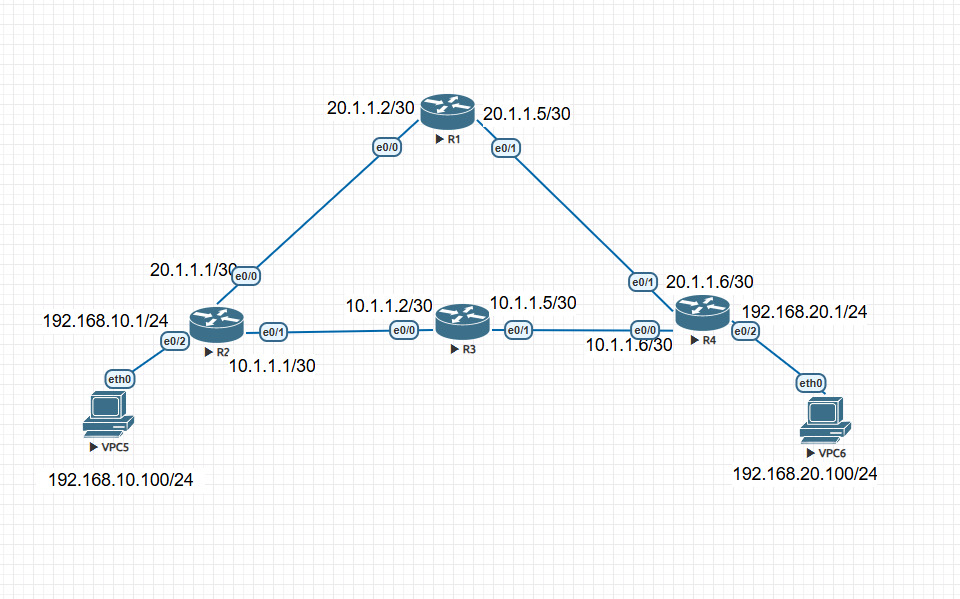
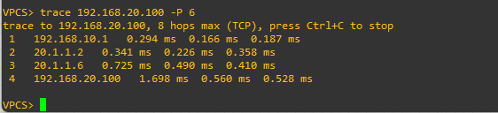

# Lab 03 — Static Routing with Path Control

**ENCOR v1.2 mapping:** 3.0 Infrastructure — Layer 3 static routing, path selection, floating static routes
**Status:** ✅ Complete — verified working

> **As-built note:** Two parallel paths between VPC5 and VPC6. Bottom path via 10.1.1.x (R2→R3→R4), top path via 20.1.1.x (R2→R1→R4). Path control achieved by selecting the appropriate static route on R2 and R4. Floating static (AD manipulation) is the clean production approach but was explored conceptually — task completion used single active routes per task.

## Objective
Configure static routes across a four-router topology with two parallel paths. Prove path control by forcing traffic through each path independently and verifying with traceroute.

**Task 1:** Ping & trace `192.168.10.100` → `192.168.20.100` through the **10.1.1.x** path (R2→R3→R4)
**Task 2:** Ping & trace `192.168.10.100` → `192.168.20.100` through the **20.1.1.x** path (R2→R1→R4)

## Topology
```
                    [ R1 ]
              e0/0           e0/1
           20.1.1.2/30    20.1.1.5/30
              |                |
           20.1.1.1/30    20.1.1.6/30
           e0/0              e0/1
  VPC5 --- [ R2 ] --- [ R3 ] --- [ R4 ] --- VPC6
           e0/1  e0/0  e0/1  e0/0
        10.1.1.1  10.1.1.2  10.1.1.5  10.1.1.6
              /30      /30      /30      /30
```




## Addressing
| Device | Interface | IP / Mask | Connected to |
|--------|-----------|-----------|--------------|
| R1 | e0/0 | 20.1.1.2 /30 | R2 e0/0 |
| R1 | e0/1 | 20.1.1.5 /30 | R4 e0/1 |
| R2 | e0/0 | 20.1.1.1 /30 | R1 e0/0 |
| R2 | e0/1 | 10.1.1.1 /30 | R3 e0/0 |
| R2 | e0/2 | 192.168.10.1 /24 | VPC5 |
| R3 | e0/0 | 10.1.1.2 /30 | R2 e0/1 |
| R3 | e0/1 | 10.1.1.5 /30 | R4 e0/0 |
| R4 | e0/0 | 10.1.1.6 /30 | R3 e0/1 |
| R4 | e0/1 | 20.1.1.6 /30 | R1 e0/1 |
| R4 | e0/2 | 192.168.20.1 /24 | VPC6 |
| VPC5 | eth0 | 192.168.10.100 /24 | R2 e0/2 (GW .1) |
| VPC6 | eth0 | 192.168.20.100 /24 | R4 e0/2 (GW .1) |

## Link plan (all /30 point-to-point)
| Link | Subnet | A side | B side | Path |
|------|--------|--------|--------|------|
| R2 ↔ R1 | 20.1.1.0/30 | R2 e0/0 (.1) | R1 e0/0 (.2) | Top (20.x) |
| R1 ↔ R4 | 20.1.1.4/30 | R1 e0/1 (.5) | R4 e0/1 (.6) | Top (20.x) |
| R2 ↔ R3 | 10.1.1.0/30 | R2 e0/1 (.1) | R3 e0/0 (.2) | Bottom (10.x) |
| R3 ↔ R4 | 10.1.1.4/30 | R3 e0/1 (.5) | R4 e0/0 (.6) | Bottom (10.x) |

Full device configs are in [`configs/`](configs/).

## Verification — commands & expected output

**1. Routing tables show the correct next-hop per task**
```
R2# show ip route static
! Task 1: expect 192.168.20.0/24 via 10.1.1.2 (R3)
! Task 2: expect 192.168.20.0/24 via 20.1.1.2 (R1)
```

**2. Task 1 traceroute (10.1.1.x path)**
```
VPC5> trace 192.168.20.100
1  192.168.10.1     (R2)
2  10.1.1.2         (R3)
3  10.1.1.6         (R4 — but shown as next-hop on that segment)
4  192.168.20.100   (VPC6)
```


**3. Task 2 traceroute (20.1.1.x path)**
```
VPC5> trace 192.168.20.100
1  192.168.10.1     (R2)
2  20.1.1.2         (R1)
3  20.1.1.6         (R4 — but shown as next-hop on that segment)
4  192.168.20.100   (VPC6)
```


> The traceroute hop IPs prove which path was taken: 10.x hops = bottom path, 20.x hops = top path.

## Troubleshooting
| Symptom | Likely cause | Check / fix |
|---------|--------------|-------------|
| Ping to own gateway fails | Interface down or wrong IP | `show ip int brief` on the connected router |
| Gateway reachable, remote host not | Missing or wrong static route on a transit router | `show ip route` on every router in the path |
| Traceroute shows wrong path | Both routes active (ECMP) — equal AD | `show ip route 192.168.20.0` — two entries? Remove one or set AD |
| "host not reachable" from VPC | VPC gateway not set or wrong | `show ip` on VPC, re-set with `/24` prefix |
| R4 route uses wrong interface for next-hop | Interface/next-hop mismatch (the bug found in this lab) | Verify the next-hop IP is reachable out the specified interface |

## Key takeaways
- **Interface + next-hop in a static route must be consistent** — if you specify both, the next-hop must be ARP-reachable out that interface. Swapping them is a silent, fatal misconfiguration.
- Two static routes to the same prefix with the same AD = **ECMP load balancing**, not primary/backup. Traceroute will alternate between paths.
- To force a single path: either use only one route, or set a higher **AD (floating static)** on the backup — e.g. `ip route 192.168.20.0 255.255.255.0 e0/0 20.1.1.2 10` makes that route AD 10 (backup to the default AD 1 route).
- R3 only needs routes along the 10.x path — it's not on the 20.x path, so it doesn't need 20.x routes.
- `/30` subnets are the standard for point-to-point links: 4 addresses, 2 usable (one per router end).
