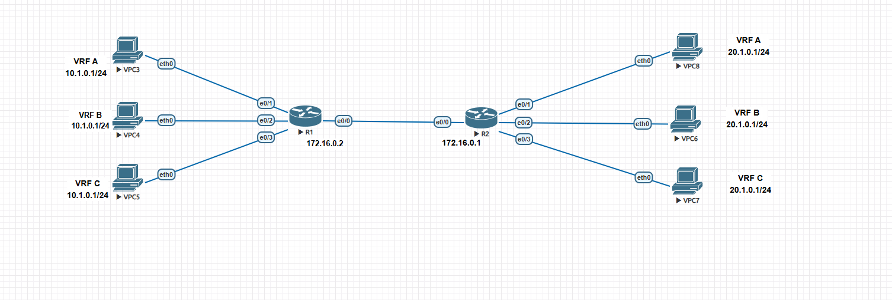
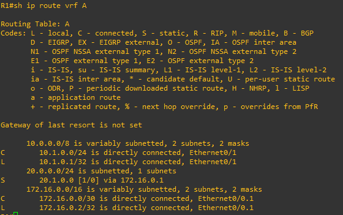
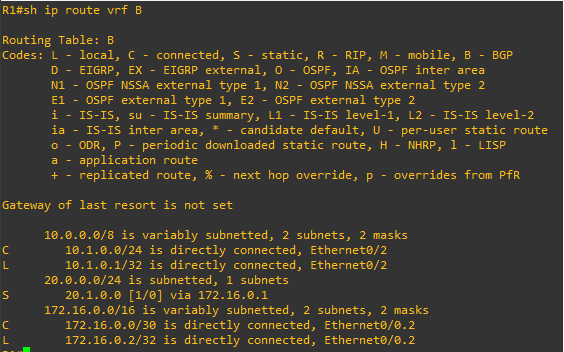
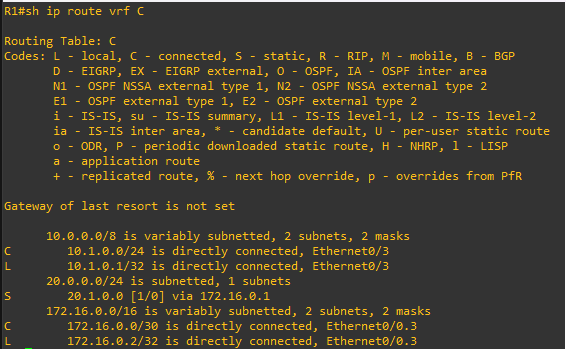
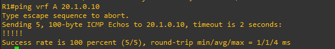
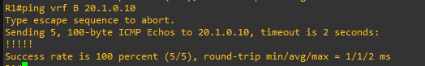
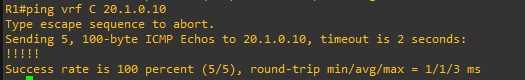
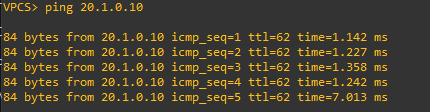
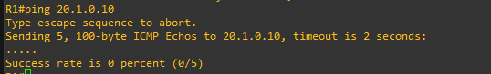

# Lab 05 — VRF Lite (Virtual Routing and Forwarding)

**ENCOR v1.2 mapping:** 2.0 Virtualization — VRF, network segmentation
**Status:** ✅ Complete — verified working

## Objective

Create three completely isolated routing tables (VRF A, B, C) on the same pair of routers, each carrying **overlapping IP addresses**. Prove that traffic in one VRF cannot reach or interfere with traffic in another, even though they use identical IPs.

**Expected result (from R1):**
```
R1# ping vrf A 20.1.0.1    → success (VRF A path only)
R1# ping vrf B 20.1.0.1    → success (VRF B path only)
R1# ping vrf C 20.1.0.1    → success (VRF C path only)
```

---

## What is VRF? (Simple version)

A router normally has **one routing table**. VRF gives it **multiple separate routing tables** on the same physical box. Each VRF is like a router inside a router — with its own interfaces, its own routes, and its own forwarding decisions. Traffic in VRF A has no idea VRF B exists.

**Why it matters:** ISPs use VRFs to carry thousands of customers on the same backbone without their traffic mixing. Enterprises use them to separate departments (guest WiFi vs corporate vs IoT) on shared infrastructure. Same hardware, complete isolation.

**The key rule:** `ip vrf forwarding` must come **before** `ip address` on an interface. If you apply VRF after the IP, IOS wipes the address and warns you.

---

## Topology

```
  VPC3 (VRF A)               VPC8 (VRF A)
  10.1.0.10/24               20.1.0.10/24
       |  e0/1                e0/1  |
       |                            |
  VPC4 (VRF B)    e0/0 ════ e0/0    VPC6 (VRF B)
  10.1.0.10/24 ── [R1] ──── [R2] ── 20.1.0.10/24
       |  e0/2   (dot1Q)    e0/2  |
       |          trunk            |
  VPC5 (VRF C)                VPC7 (VRF C)
  10.1.0.10/24               20.1.0.10/24
       |  e0/3                e0/3  |
```



- **LAN side:** each VPC has a dedicated physical port (one VRF per port, no tagging needed)
- **WAN side:** one cable between R1 and R2, carrying all three VRFs via dot1Q subinterfaces (VLAN 10 = VRF A, 20 = VRF B, 30 = VRF C)

## Addressing

All three VRFs use **overlapping IPs** — this is the whole point of VRF.

| VRF | R1 LAN (e0/x) | R1 WAN (e0/0.x) | R2 WAN (e0/0.x) | R2 LAN (e0/x) |
|:---:|----------------|-----------------|-----------------|----------------|
| A | 10.1.0.1/24 (e0/1) | 172.16.0.2/30 (.1, v10) | 172.16.0.1/30 (.1, v10) | 20.1.0.1/24 (e0/1) |
| B | 10.1.0.1/24 (e0/2) | 172.16.0.2/30 (.2, v20) | 172.16.0.1/30 (.2, v20) | 20.1.0.1/24 (e0/2) |
| C | 10.1.0.1/24 (e0/3) | 172.16.0.2/30 (.3, v30) | 172.16.0.1/30 (.3, v30) | 20.1.0.1/24 (e0/3) |

| VPC | VRF | IP | Gateway | Connected to |
|-----|:---:|----|---------|-------------|
| VPC3 | A | 10.1.0.10/24 | 10.1.0.1 | R1 e0/1 |
| VPC4 | B | 10.1.0.10/24 | 10.1.0.1 | R1 e0/2 |
| VPC5 | C | 10.1.0.10/24 | 10.1.0.1 | R1 e0/3 |
| VPC8 | A | 20.1.0.10/24 | 20.1.0.1 | R2 e0/1 |
| VPC6 | B | 20.1.0.10/24 | 20.1.0.1 | R2 e0/2 |
| VPC7 | C | 20.1.0.10/24 | 20.1.0.1 | R2 e0/3 |

Notice: VPC3, VPC4, and VPC5 all have IP **10.1.0.10** — identical. But they're on different physical ports assigned to different VRFs, so they never collide.

Full device configs are in [`configs/`](configs/).

---

## How VRF isolates traffic

Without VRF, R1 has one routing table. With VRF, R1 has **three**:

```
R1# show ip route vrf A
  C   10.1.0.0/24   via Ethernet0/1
  C   172.16.0.0/30 via Ethernet0/0.1
  S   20.1.0.0/24   via 172.16.0.1

```


```
R1# show ip route vrf B
  C   10.1.0.0/24   via Ethernet0/2          ← same prefix, different interface
  C   172.16.0.0/30 via Ethernet0/0.2
  S   20.1.0.0/24   via 172.16.0.1
```



```
R1# show ip route vrf C
  C   10.1.0.0/24   via Ethernet0/3
  C   172.16.0.0/30 via Ethernet0/0.3
  S   20.1.0.0/24   via 172.16.0.1
```




Three tables, same prefixes, completely independent forwarding paths. A packet from VPC3 (VRF A) enters e0/1, gets looked up in VRF A's table, and is forwarded through e0/0.1 (VLAN 10). VRF B and C never see it.

---

## Verification

**1. Confirm VRF-to-interface mapping:**
```
R1# show ip vrf
  Name    Default RD    Interfaces
  A       <not set>     Et0/1, Et0/0.1
  B       <not set>     Et0/2, Et0/0.2
  C       <not set>     Et0/3, Et0/0.3
```

**2. Per-VRF routing table:**
```
R1# show ip route vrf A
R1# show ip route vrf B
R1# show ip route vrf C
```
Each should show three routes: connected LAN, connected WAN, and static to the far side.

**3. The deliverable — per-VRF pings from R1:**
```
R1# ping vrf A 20.1.0.1    → success
R1# ping vrf B 20.1.0.1    → success
R1# ping vrf C 20.1.0.1    → success
```








**4. End-to-end from VPCs:**
```
VPC3> ping 20.1.0.10        → success (VRF A: VPC3 → R1 → R2 → VPC8)
VPC4> ping 20.1.0.10        → success (VRF B: VPC4 → R1 → R2 → VPC6)
VPC5> ping 20.1.0.10        → success (VRF C: VPC5 → R1 → R2 → VPC7)
```


**5. Prove isolation — a global ping should fail:**
```
R1# ping 20.1.0.1           → FAIL (no route in the global table)
R1# ping 10.1.0.10          → FAIL (not in global table either)
```




This proves the routes exist only inside their VRFs, not in the global routing table.

---

## Troubleshooting

| Symptom | Likely cause | Check / fix |
|---------|--------------|-------------|
| `% Interface EthernetX/X IPv4 disabled and address removed` | Applied `ip vrf forwarding` after `ip address` | VRF wipes the IP — re-enter the address after the VRF command |
| `ping vrf A 172.16.0.1` fails | Subnet mask mismatch on WAN subinterfaces | Both ends must be /30 (255.255.255.252) |
| `show ip vrf` doesn't list an interface | VRF not applied on that interface | `show run int e0/x` — check for `ip vrf forwarding` |
| VPC can ping gateway but not far side | Static route missing or wrong next-hop | `show ip route vrf X` — static route to 20.1.0.0 or 10.1.0.0 must exist |
| Global ping works (it shouldn't) | Interface not in a VRF | `show ip vrf` — interface should appear under its VRF, not be missing |

## Key takeaways

- VRF creates **multiple routing tables on one router** — each is completely isolated.
- Same IP address (10.1.0.1) can exist on three interfaces without conflict because each belongs to a different VRF.
- **LAN side:** one physical port per VRF is the simplest approach (no tagging needed).
- **WAN side:** one cable carrying multiple VRFs uses dot1Q subinterfaces (same pattern as router-on-a-stick from Lab 02, but now each subinterface belongs to a VRF).
- `ip vrf forwarding` before `ip address` — always. IOS enforces this by wiping the IP if you reverse the order.
- Routes, pings, and all CLI commands that touch VRF data need the `vrf` keyword: `ping vrf A`, `show ip route vrf A`, `ip route vrf A`.
- A successful global `ping 20.1.0.1` (without `vrf`) means something is NOT in a VRF when it should be — that's a misconfiguration.
