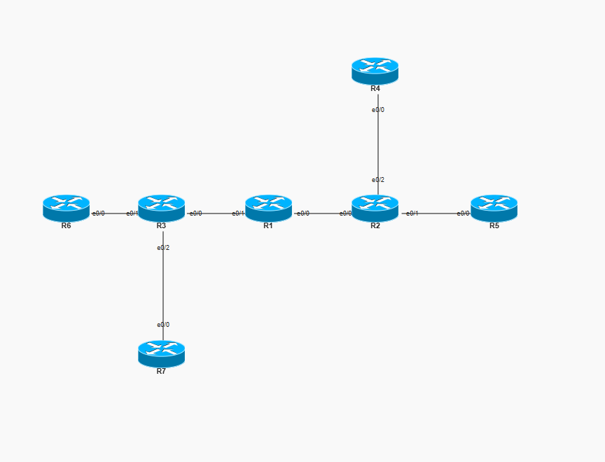
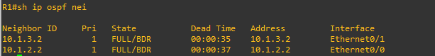
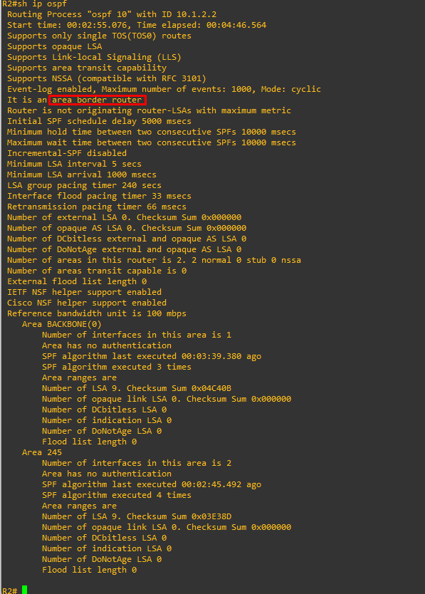
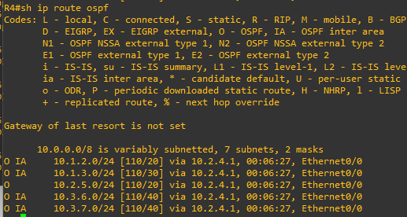
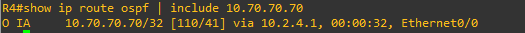
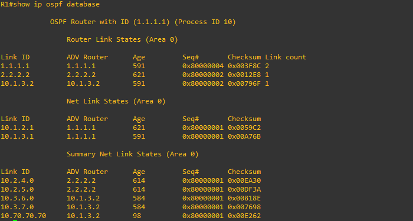
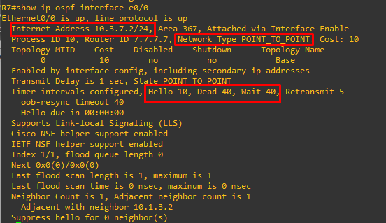
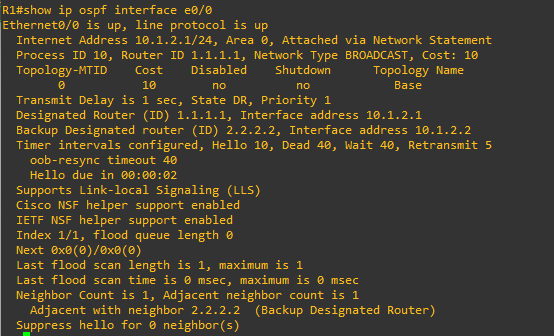

# Lab 06 — Multi-Area OSPF

**ENCOR v1.2 mapping:** 3.0 Infrastructure — OSPF multi-area design, adjacency, DR/BDR, ABR, LSA types
**Status:** ✅ Complete — verified working

## Objective

Build a three-area OSPF network (area 0 backbone + two non-backbone areas), verify full adjacency formation, observe inter-area routes (`O IA`), and understand DR/BDR election, loopback advertisement, and the OSPF adjacency requirements.

---

## OSPF Adjacency — The 8 Mandatory Rules

Two routers will **never** form an OSPF neighbor relationship unless ALL of these match on the shared link:

| # | Requirement | What it means | Show command |
|---|-------------|---------------|--------------|
| 1 | **Unique Router ID** | Every router in the OSPF domain must have a different RID. Duplicate = neighbor rejected. | `show ip ospf` |
| 2 | **Common subnet on the shared interface** | Both interfaces must be in the same IP subnet and mask. 10.1.2.1/24 and 10.1.2.2/24 = OK. 10.1.2.1/24 and 10.1.2.2/25 = FAIL. | `show ip interface brief` |
| 3 | **Matching area ID** | Both interfaces must be in the same OSPF area. Carried in Hello packets. | `show ip ospf interface` |
| 4 | **Matching MTU** | If MTU differs, neighbors get stuck in **EXSTART/EXCHANGE** (DBD packets rejected). Fix with matching MTU or `ip ospf mtu-ignore`. | `show interface e0/0` |
| 5 | **Matching area type flags** | Both routers must agree on area type (normal, stub, NSSA). The E-bit and N-bit in Hello packets must match. | `show ip ospf` |
| 6 | **Matching Hello/Dead timers** | Default: Hello 10s, Dead 40s. If one side is 10/40 and the other is 30/120, no neighbors. | `show ip ospf interface` |
| 7 | **Matching authentication** | If one side has `ip ospf authentication`, the other must too, with the same key. | `show ip ospf interface` |
| 8 | **Matching network type** | Both sides must agree on network type (broadcast, point-to-point, etc). Affects DR/BDR election and Hello behavior. | `show ip ospf interface` |

**Mnemonic: "U-SAAM-HAN"** — Unique RID, Subnet, Area, Area-flags, MTU, Hello/Dead, Authentication, Network-type.

If neighbors are stuck in **INIT** → check area, timers, authentication, network type.
If neighbors are stuck in **EXSTART** → almost always MTU mismatch.

---

## OSPF Area ID — Two Valid Formats

Area IDs are 32-bit numbers, just like IP addresses. You can type them in **decimal** or **dotted decimal** — both are valid and IOS accepts either:

| Decimal | Dotted Decimal | Description |
|:--------|:---------------|-------------|
| `0` | `0.0.0.0` | Backbone Area |
| `1` | `0.0.0.1` | Area 1 |
| `10` | `0.0.0.10` | Area 10 |
| `100` | `0.0.0.100` | Area 100 |
| `245` | `0.0.0.245` | Area 245 (used in this lab) |
| `367` | `0.0.1.111` | Area 367 (used in this lab) |
| `65535` | `0.0.255.255` | Equivalent representation |
| `4294967295` | `255.255.255.255` | Maximum Area ID |

These two commands are identical:
```
ip ospf 10 area 0
ip ospf 10 area 0.0.0.0
```

IOS stores area IDs internally as 32-bit integers. When you type `area 245`, IOS may display it as `area 0.0.0.245` in some `show` outputs — same value, different format. In `show ip ospf`, backbone always appears as `Area 0` or `Area 0.0.0.0` depending on the IOS version.

For the exam: small area numbers (0, 1, 10, 245) are usually shown in decimal. Large numbers or ISP-style configurations may use dotted decimal. Know that both are valid and equivalent.

---

## OSPF Multicast Addresses

OSPF uses **multicast**, not broadcast or unicast, for Hello and update packets:

| Address | Destination | Used by |
|---------|-------------|---------|
| **224.0.0.5** | AllSPFRouters | Every OSPF router listens on this. Hellos on point-to-point and DR/BDR updates go here. |
| **224.0.0.6** | AllDRouters | Only the DR and BDR listen. DROther routers send their updates here (so only DR/BDR process them). |

**Multicast MAC addresses** (Layer 2 mapping):

| IP | MAC |
|----|-----|
| 224.0.0.5 | `01:00:5E:00:00:05` |
| 224.0.0.6 | `01:00:5E:00:00:06` |

These are **link-local** multicast addresses (TTL=1) — they never cross a router. OSPF packets stay on the directly connected segment.

---

## DR/BDR Election

On **broadcast** and **non-broadcast** network types, OSPF elects a **Designated Router (DR)** and a **Backup DR (BDR)** to reduce the number of adjacencies:

**Election rules (in priority order):**

1. **Highest OSPF priority** wins DR. Default priority = 1. Priority 0 = "I refuse to be DR."
2. **Tie-breaker: highest Router ID** wins.
3. **Non-preemptive:** once elected, a DR stays DR even if a router with higher priority joins later. Only a DR failure triggers a new election.

```
! Force R7 to win DR on its segment:
interface e0/0
 ip ospf priority 100        ← highest priority wins
```

**On point-to-point links:** no DR/BDR election at all. Only two routers on the link, so they form a direct adjacency. This is why R7 has `ip ospf network point-to-point` — it skips the DR election on its link to R3.

---

## Router ID Selection (priority order)

1. **Manually configured** `router-id X.X.X.X` (highest priority — always wins)
2. **Highest loopback IP** (if no manual RID)
3. **Highest physical interface IP** (if no loopback)

```
! R7 example: manual RID overrides the loopback
router ospf 10
 router-id 7.7.7.7           ← this wins
!
interface Loopback100
 ip address 10.70.70.70      ← would be RID if no manual config
```

A Router ID change requires `clear ip ospf process` to take effect on a running router.

---

## Topology

```
                        [ R4 ]
                        e0/0
                      10.2.4.2
                          |
                      10.2.4.1
                        e0/2
[ R6 ]──e0/0──e0/1──[ R3 ]──e0/0──e0/1──[ R1 ]──e0/0──[ R2 ]──e0/1──e0/0──[ R5 ]
10.3.6.2    10.3.6.1  10.1.3.2  10.1.3.1  10.1.2.1  10.1.2.2  10.2.5.1  10.2.5.2
                        e0/2
                      10.3.7.1
                          |
                      10.3.7.2
                        e0/0
                        [ R7 ]
                     Lo100: 10.70.70.70

|── Area 367 ──|──── Area 0 ────|──── Area 245 ───|
  R6, R7, R3*      R1, R2*, R3*     R4, R5, R2*
              (* = ABR)
```


## IOU Web Topology




## Addressing

| Device | Interface | IP | Area | Role |
|--------|-----------|------|:----:|------|
| R1 | e0/0 | 10.1.2.1/24 | 0 | Backbone |
| R1 | e0/1 | 10.1.3.1/24 | 0 | Backbone |
| R2 | e0/0 | 10.1.2.2/24 | 0 | ABR (area 0 side) |
| R2 | e0/1 | 10.2.5.1/24 | 245 | ABR (area 245 side) |
| R2 | e0/2 | 10.2.4.1/24 | 245 | ABR (area 245 side) |
| R3 | e0/0 | 10.1.3.2/24 | 0 | ABR (area 0 side) |
| R3 | e0/1 | 10.3.6.1/24 | 367 | ABR (area 367 side) |
| R3 | e0/2 | 10.3.7.1/24 | 367 | ABR (area 367 side) |
| R4 | e0/0 | 10.2.4.2/24 | 245 | Internal |
| R5 | e0/0 | 10.2.5.2/24 | 245 | Internal |
| R6 | e0/0 | 10.3.6.2/24 | 367 | Internal |
| R7 | e0/0 | 10.3.7.2/24 | 367 | Internal |
| R7 | Lo100 | 10.70.70.70/32 | 367 | Loopback (stable ID) |

## Two ways to assign OSPF on an interface

Both appear in this lab — they do the same thing:

```
! Method 1: network command under router ospf (used on R1, R2 area-0 side)
router ospf 10
 network 10.1.2.1 0.0.0.0 area 0

! Method 2: directly on the interface (used on R2 area-245 side, R3-R7)
interface e0/1
 ip ospf 10 area 245
```

Method 2 is newer and more explicit. Both are valid and can be mixed on the same router (R2 uses both).

---

## Verification

**1. Neighbors formed:**
```
R1# show ip ospf neighbor
! Expect: R2 (via 10.1.2.2) and R3 (via 10.1.3.2), both FULL
```


**2. R2 is an ABR (interfaces in two areas):**
```
R2# show ip ospf
! Look for: "Area 0" and "Area 245" both listed
! "Area Border Router" flag should appear
```


**3. Inter-area routes visible:**
```
R4# show ip route ospf
! O IA  10.1.2.0/24  ← inter-area (from area 0, via ABR R2)
! O IA  10.1.3.0/24  ← inter-area (from area 0, via ABR R2)
! O IA  10.3.6.0/24  ← inter-area (from area 367, via ABRs R2→R1→R3)
```


**4. R7's loopback visible across areas:**
```
R4# show ip route ospf | include 10.70.70.70
! O IA  10.70.70.70/32  ← R7's loopback, learned inter-area
```


**5. OSPF database (LSA types):**
```
R1# show ip ospf database
! Router LSAs (Type 1): from every router in area 0
! Network LSAs (Type 2): from DR on multi-access segments
! Summary LSAs (Type 3): from ABRs (R2 for area 245, R3 for area 367)
```



**6. DR/BDR check:**
```
R7# show ip ospf interface e0/0
! If point-to-point: no DR/BDR listed
! If broadcast (default): shows DR/BDR with RIDs and priorities
```


**7. OSPF interface details:**
```
R1# show ip ospf interface e0/0
! Area 0, Network Type BROADCAST, Cost 10
! Hello 10, Dead 40, Wait 40, Retransmit 5
! DR/BDR election results
```



---

## Troubleshooting

| Symptom | Likely cause | Check / fix |
|---------|--------------|-------------|
| Neighbor stuck in INIT | Area mismatch, timer mismatch, auth mismatch, or network type mismatch | `show ip ospf interface` both sides — compare all parameters |
| Neighbor stuck in EXSTART | MTU mismatch | `show interface e0/0` both sides — MTU must match, or use `ip ospf mtu-ignore` |
| No inter-area routes (no O IA) | ABR not in area 0 | ABR must have at least one interface in area 0 |
| Duplicate Router ID error | Two routers have same RID | `show ip ospf` — set unique `router-id` on each |
| Loopback shows as /32 even with /24 mask | OSPF always advertises loopbacks as /32 | Normal behavior — use `ip ospf network point-to-point` on the loopback to advertise the configured mask |
| DR election not as expected | Priority or RID issue; DR is non-preemptive | Check priorities with `show ip ospf interface`; clear process to force re-election |
| R7's point-to-point: no DR/BDR | `ip ospf network point-to-point` configured | Expected behavior — no election needed on P2P |

## Key takeaways

- **OSPF process ID is local** — process 10 on R1 and process 20 on R2 still form neighbors. Only the **area ID** must match on the shared link.
- **ABRs connect areas** — R2 bridges area 0 and 245, R3 bridges area 0 and 367. An ABR must have at least one interface in area 0.
- **Inter-area routes appear as `O IA`** — they're Type 3 Summary LSAs generated by the ABR.
- **Router ID priority:** manual `router-id` > highest loopback IP > highest physical IP. Always set it manually for predictability.
- **DR election is non-preemptive** — a new router with higher priority won't take over until the current DR fails. Priority 0 = never DR.
- **`ip ospf network point-to-point`** skips DR/BDR election and advertises the actual mask on loopbacks (instead of forcing /32).
- **OSPF multicast:** 224.0.0.5 (AllSPFRouters) for Hellos and updates, 224.0.0.6 (AllDRouters) for DROther→DR/BDR communication. Both are link-local (TTL=1).
- **All 8 adjacency rules must match** or neighbors won't form — the most common exam topic after basic configuration.

Full device configs are in [`configs/`](configs/).
