# Lab 07 — Advanced OSPF: Multi-Area, Stub, NSSA, Virtual-Links, Redistribution

**ENCOR v1.2 mapping:** 3.0 Infrastructure — OSPF multi-area, area types, virtual-links, multi-process redistribution, DR/BDR
**Status:** ✅ Complete — verified working

## Objective

Build an 11-router OSPF network covering every major OSPF feature: multi-area design, DR/BDR election with priority, stub area, totally stubby area, NSSA, virtual-link chaining, multi-process OSPF redistribution, and loopback advertisement.

---

## Topology

```
                            [ R7 ]  OSPF 100
                          10.1.7.7
                              |  (P2P)
                          10.1.7.1
           R1 ASBR              e0/1
  (OSPF 10 <-> 100)            [ R1 ]  pri=0
                            10.0.0.1
                                |
  [ R6 ]                   [== SW1 ==]                      [ R9 ]  OSPF 900
192.168.x.x               /    |     \                    10.5.9.9
  10.2.6.6            10.0.0.2 10.0.0.3 10.0.0.4             |  (P2P)
     |  (P2P)           /      |        \                 10.5.9.5
  10.2.6.2         [ R2 ]   [ R3 ]    [ R4 ]              e0/1
   e0/1           pri=100  pri=80    pri=50              [ R5 ]  ASBR
  [ R2 ] ABR       (DR)    (BDR)       |  e0/1          10.3.5.5
  area 26          e0/1     e0/1    10.4.8.4                |  (P2P)
  STUB           10.2.6.2 10.3.5.3     |  (P2P)        10.3.5.3
                 area 26  area 35   10.4.8.8              e0/1
                 STUB     NSSA       [ R8 ] ---- 10.8.10.8    [ R3 ] ABR
                                   area 48  (P2P)  area 108   area 35
                           R4 e0/2      |         10.8.10.10  NSSA
                         10.4.11.4   VL: R4<->R8  [ R10 ]
                              |      VL: R8<->R10  VL to area 0
                          10.4.11.11
                           [ R11 ]
                          area 411
                       TOTALLY STUB
                        (OSPF 100)
```

## EVE-NG Topology

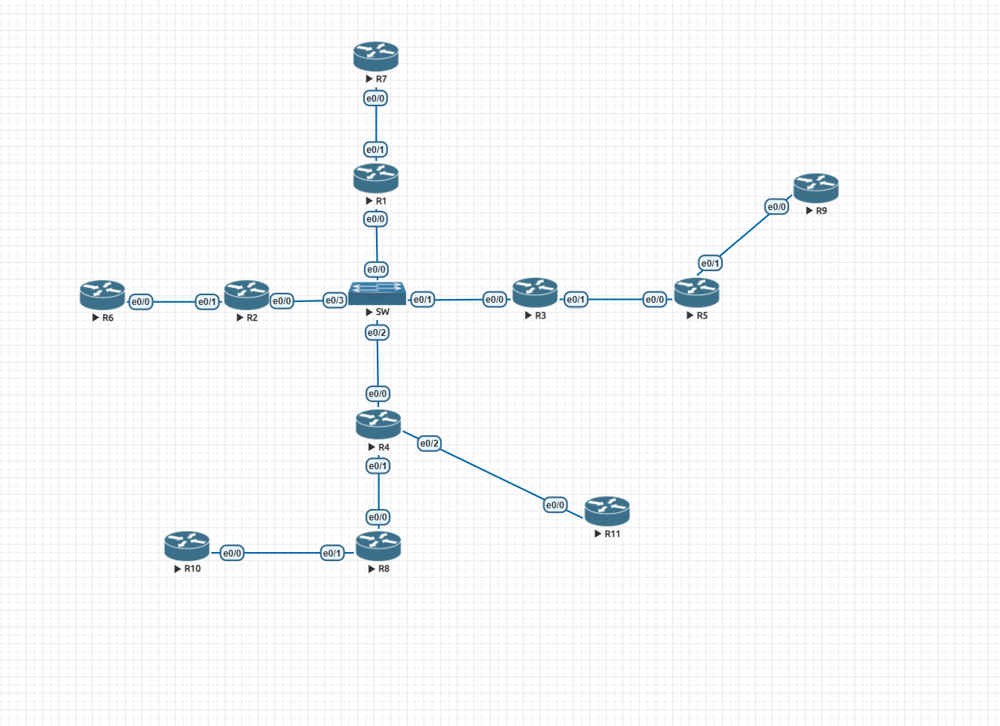

## Addressing

| Device | Interface | IP | Area | OSPF Process | Role |
|--------|-----------|------|------|:------------:|------|
| R1 | e0/0 | 10.0.0.1/24 | 0 | 10 | Backbone (pri 0, never DR) |
| R1 | e0/1 | 10.1.7.1/24 | 0 | 100 | ASBR link to R7 |
| R1 | Lo1 | 1.1.1.1/32 | — | — | Router ID |
| R2 | e0/0 | 10.0.0.2/24 | 0 | 10 | Backbone (pri 100, DR) |
| R2 | e0/1 | 10.2.6.2/24 | 26 | 10 | ABR → stub area |
| R2 | Lo1 | 2.2.2.2/32 | — | — | Router ID |
| R3 | e0/0 | 10.0.0.3/24 | 0 | 10 | Backbone (pri 80, BDR) |
| R3 | e0/1 | 10.3.5.3/24 | 35 | 10 | ABR → NSSA |
| R3 | Lo1 | 3.3.3.3/32 | — | — | Router ID |
| R4 | e0/0 | 10.0.0.4/24 | 0 | 10 | Backbone (pri 50) |
| R4 | e0/1 | 10.4.8.4/24 | 48 | 10 | ABR, virtual-link to R8 |
| R4 | e0/2 | 10.4.11.4/24 | 411 | 100 | ASBR → totally stub |
| R4 | Lo1 | 4.4.4.4/32 | — | — | Router ID |
| R5 | e0/0 | 10.3.5.5/24 | 35 | 10 | NSSA internal + ASBR |
| R5 | e0/1 | 10.5.9.5/24 | 0 | 900 | Link to R9 (separate OSPF) |
| R5 | Lo100-102 | 172.16.x.5/32 | 35 | 10 | Advertised in NSSA |
| R5 | Lo1 | 5.5.5.5/32 | — | — | Router ID |
| R6 | e0/0 | 10.2.6.6/24 | 26 | 10 | Stub internal |
| R6 | Lo100-102 | 192.168.x.6/32 | 26 | 10 | Advertised in stub |
| R6 | Lo1 | 6.6.6.6/32 | — | — | Router ID |
| R7 | e0/0 | 10.1.7.7/24 | 0 | 100 | Separate OSPF domain |
| R7 | Lo100-102 | 10.10.x.7/32 | 17 | 100 | OSPF 100 area 17 |
| R7 | Lo1 | 7.7.7.7/32 | — | — | Router ID |
| R8 | e0/0 | 10.4.8.8/24 | 48 | 10 | VL to R4 + R10 |
| R8 | e0/1 | 10.8.10.8/24 | 108 | 10 | VL transit to R10 |
| R8 | Lo100-102 | 192.168.20x.8/32 | 48 | 10 | Advertised in area 48 |
| R8 | Lo1 | 8.8.8.8/32 | — | — | Router ID |
| R9 | e0/0 | 10.5.9.9/24 | 0 | 900 | Separate OSPF domain |
| R9 | Lo1 | 9.9.9.9/32 | — | — | Router ID |
| R10 | e0/0 | 10.8.10.10/24 | 108 | 10 | VL to area 0 via R8 |
| R10 | Lo100-102 | 192.168.21x.10/32 | 48 | 10 | Advertised in area 48 |
| R10 | Lo1 | 10.10.10.10/32 | — | — | Router ID |
| R11 | e0/0 | 10.4.11.11/24 | 411 | 100 | Totally stub internal |
| R11 | Lo1 | 11.11.11.11/32 | — | — | Router ID |

---

## Build Order (how I configured this lab)

### Step 1 — Backbone: R1, R2, R3, R4 initial OSPF + switch

Configured all four backbone routers with their e0/0 interfaces in area 0, set router-ids, and configured the L2 switch connecting them. Verified adjacency with `show ip ospf neighbor` on each router.

DR/BDR election on 10.0.0.0/24 (broadcast segment):
- **R2 = DR** (priority 100)
- **R3 = BDR** (priority 80)
- **R4 = DROther** (priority 50)
- **R1 = DROther** (priority 0, never DR)

### Step 2 — Non-backbone routers: sequential P2P links

Configured each router-to-router link one at a time, verified neighbor before moving to the next. All inter-router links use `ip ospf network point-to-point` (no DR/BDR needed on P2P links). Build order: R2-R6, R3-R5, R4-R8, R5-R9, R8-R10, R4-R11, R1-R7.

### Step 3 — Loopbacks

Added loopback interfaces on all routers. Router-ID loopbacks (Lo1) are used for identification only. Service loopbacks (Lo100-102) are advertised into their respective OSPF areas.

### Step 4 — Virtual-links

**R4 <-> R8** through area 48: extends area 0 so R8 becomes an ABR.
```
! R4: area 48 virtual-link 8.8.8.8
! R8: area 48 virtual-link 4.4.4.4
```

**R8 <-> R10** through area 108: extends area 0 further so R10 can reach the backbone.
```
! R8:  area 108 virtual-link 10.10.10.10
! R10: area 108 virtual-link 8.8.8.8
```

**Key debug:** virtual-link stayed DOWN because R8's router-id was auto-selected as 10.4.8.8 instead of the configured 8.8.8.8. Fix: `clear ip ospf process` on R8 to reload the router-id.

### Step 5 — Multi-process OSPF redistribution

**R1 (ASBR):** bridges OSPF 10 and OSPF 100 (R7's domain).
```
router ospf 10
 redistribute ospf 100 metric 10000 metric-type 2 subnets
router ospf 100
 redistribute ospf 10 subnets
```

**R5 (ASBR):** bridges OSPF 10 and OSPF 900 (R9's domain).
```
router ospf 10
 redistribute ospf 900 subnets
router ospf 900
 redistribute ospf 10 subnets
```

**R4 (ASBR):** bridges OSPF 10 and OSPF 100 (R11's domain).
```
router ospf 10
 redistribute ospf 100 subnets
router ospf 100
 redistribute ospf 10 subnets
```

### Step 6 — Area types

**Area 26 — Stub** (R2 ABR + R6):
- Blocks Type 5 external LSAs
- ABR injects default route
- R6 sees: `O IA` inter-area routes + `O*IA 0.0.0.0/0` default

**Area 35 — NSSA** (R3 ABR + R5):
- Blocks Type 5 externals from outside
- Allows R5 to inject local redistributed routes as Type 7 (N2)
- ABR converts Type 7 to Type 5 at the area 0 boundary

**Area 411 — Totally Stub** (R4 ABR + R11, OSPF 100):
- Blocks Type 5 externals AND Type 3 inter-area summaries
- R11 sees only: `O*IA 0.0.0.0/0` (default route, nothing else)

---

## OSPF Feature Map

| Feature | Where in this lab |
|---------|-------------------|
| Multi-area OSPF | Areas 0, 26, 35, 48, 108, 411, 17 |
| DR/BDR election | R1-R4 on 10.0.0.0/24 (broadcast segment via switch) |
| OSPF priority | R2=100(DR), R3=80(BDR), R4=50, R1=0(never DR) |
| Point-to-point | Every inter-router link except the backbone switch segment |
| Stub area | Area 26 (R2 ABR, R6 internal) |
| NSSA | Area 35 (R3 ABR, R5 ASBR) |
| Totally stubby | Area 411 (R4 ABR, R11 internal) |
| Virtual-link | R4<->R8 (area 48), R8<->R10 (area 108) |
| Multi-process OSPF | Process 10, 100, 900 |
| Redistribution | R1 (10<->100), R5 (10<->900), R4 (10<->100) |
| Loopback advertisement | Lo100-102 on R5, R6, R7, R8, R10 |
| Router ID (manual) | All routers: X.X.X.X matching router number |

---

## Route Types You Should See

| Prefix on R1 | Type | Meaning |
|---|---|---|
| `C 10.0.0.0/24` | Connected | Backbone (never shows as OSPF) |
| `O 10.1.3.0/24` | Intra-area | R3's link, same area 0 |
| `O IA 10.2.6.0/24` | Inter-area | From area 26 via R2 (ABR) |
| `O IA 192.168.100.6/32` | Inter-area | R6's loopback from stub area |
| `O E2 10.10.10.7/32` | External Type 2 | R7's loopback, redistributed from OSPF 100 |
| `O IA 172.16.100.5/32` | Inter-area | R5's loopback from NSSA (Type 7 converted to Type 3 at ABR) |

| Prefix on R6 (stub) | Type | Meaning |
|---|---|---|
| `O IA 10.0.0.0/24` | Inter-area | Backbone, via ABR R2 |
| `O*IA 0.0.0.0/0` | Default route | Injected by ABR (replaces all externals) |
| _(no O E1/E2)_ | — | Stub blocks all external routes |

| Prefix on R11 (totally stub) | Type | Meaning |
|---|---|---|
| `O*IA 0.0.0.0/0` | Default route | Only route — replaces everything |
| _(nothing else)_ | — | Totally stub blocks externals AND inter-area |

---

## Verification

```
! 1. All neighbors up
R1# show ip ospf neighbor
R4# show ip ospf neighbor
```
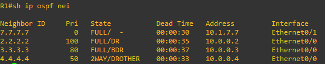

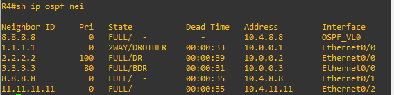

```
! 2. Virtual-links operational
R4# show ip ospf virtual-links     → to 8.8.8.8 = UP
R8# show ip ospf virtual-links     → to 4.4.4.4 = UP, to 10.10.10.10 = UP
```
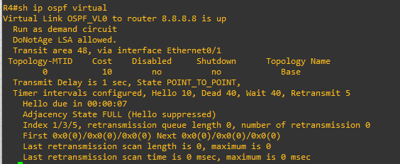

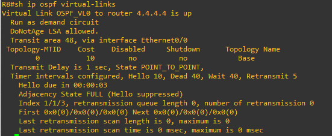

```
! 3. ABR status confirmed
R2# show ip ospf | include area border
```

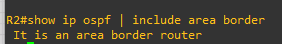

```
! 4. Area types confirmed
R6# show ip route ospf              → O IA routes + O*IA default, no externals
R11# show ip route ospf             → O*IA 0.0.0.0/0 only
R5# show ip route ospf              → O N2 routes (NSSA external from redistribution)
```
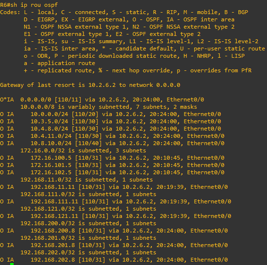

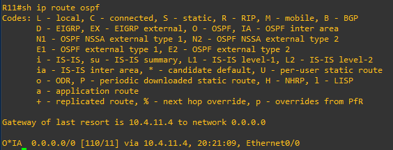

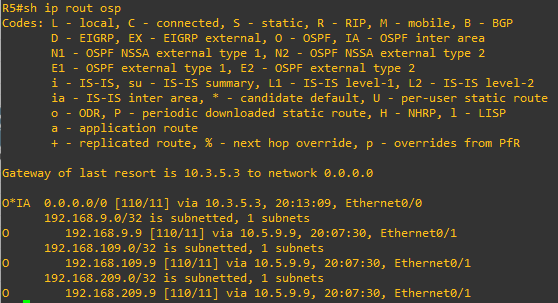


```
! 5. Redistribution working
R1# show ip route ospf | include E2  → R7's loopbacks as O E2
R3# show ip route ospf | include N2  → R9's routes as NSSA externals (if in area 35)
```
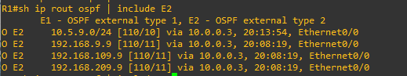

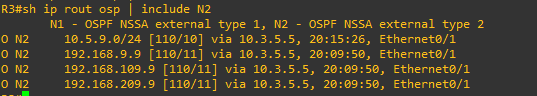

```
! 6. DR/BDR on backbone segment
R1# show ip ospf interface e0/0      → DR = 10.0.0.2 (R2), BDR = 10.0.0.3 (R3)
```
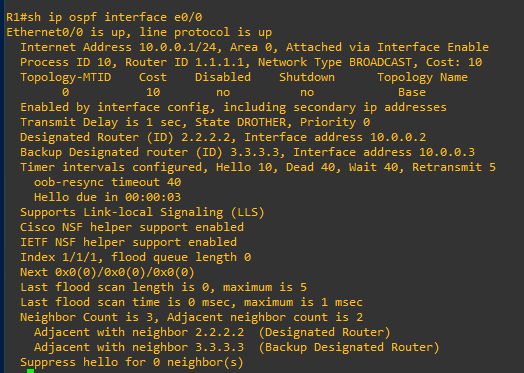

```
! 7. Full routing table
R1# show ip route ospf               → should see routes from all areas
```
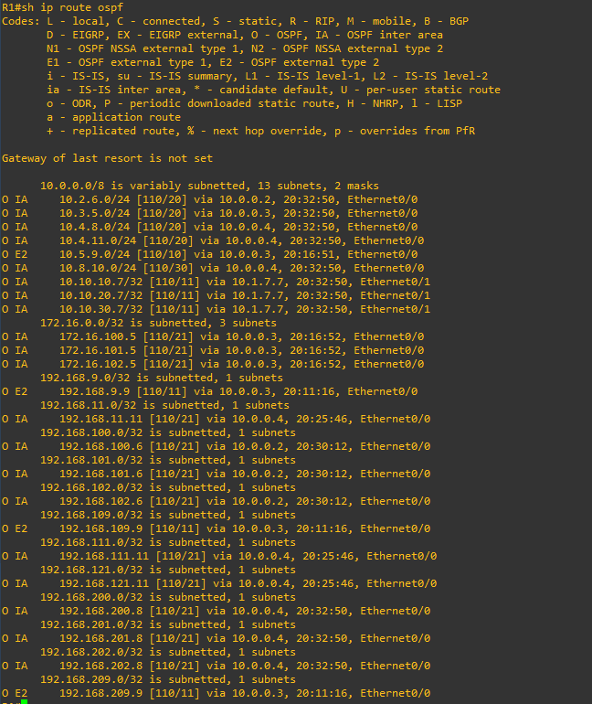

---

## Bugs Found During Build

| Router | Bug | Root cause | Fix |
|--------|-----|------------|-----|
| SW1 | Empty config | No L2 connectivity for backbone routers | Configure all ports `no shutdown` |
| R8 | Virtual-link to R4 stayed DOWN | Router-ID was 10.4.8.8 instead of 8.8.8.8 (set after OSPF started) | `clear ip ospf process` to reload RID |
| R8 | Missing virtual-link to R10 | Only R10 had the VL configured (one-sided) | Add `area 108 virtual-link 10.10.10.10` on R8 |
| R11 | Interface in OSPF process 10, stub under process 100 | Process mismatch = E-bit mismatch in Hellos | Change interface to `ip ospf 100 area 411` |
| R9 | Missing `ip ospf network point-to-point` | Network type mismatch with R5 | Add P2P on R9's e0/0 |
| R4 | Area 0 packets rejected on e0/1 | Switch was down, R4 had no area 0 = not an ABR = couldn't process VL | Configure the switch |

---

## Key Takeaways

- **Switch matters.** No L2 = no L3 = no OSPF. Always check the physical/switch layer first.
- **`router-id` needs `clear ip ospf process` if changed after OSPF is running.** Virtual-links match on exact RID — a stale RID makes the VL invisible.
- **Virtual-links are bidirectional** — both ABRs must configure them. One-sided = stays DOWN.
- **Multi-process OSPF = two separate OSPF instances on one router.** They share nothing. Routes must be explicitly redistributed between them.
- **Stub/NSSA/totally-stub flags must match on all routers in the area.** A mismatch breaks adjacency (E-bit or N-bit in Hellos).
- **Process ID is local** — process 10 on R1 and process 100 on R7 can't form neighbors (they're on the same link), but they don't need to match. They're separate OSPF domains bridged by redistribution.
- **Connected routes never appear as OSPF.** If all your routers share one subnet, `show ip route ospf` is empty until routes from other areas arrive.
- **DR election is non-preemptive.** Priority 0 = never DR. Highest priority wins, RID breaks ties.

Full device configs are in [`configs/`](configs/).
