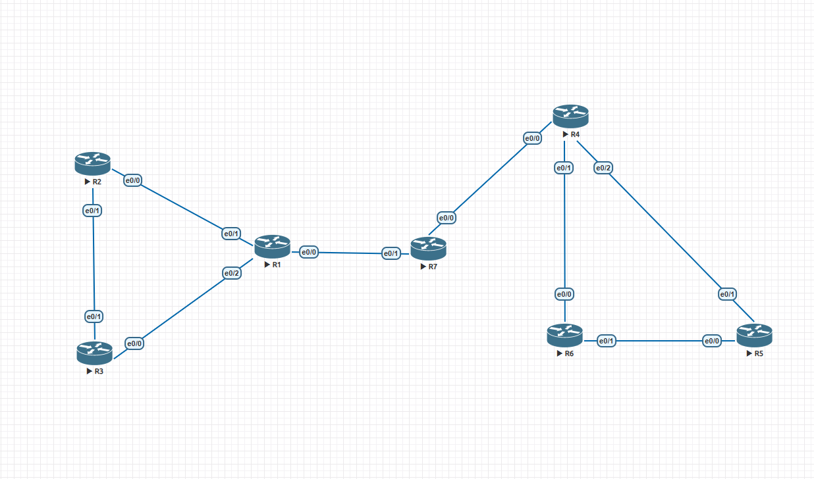
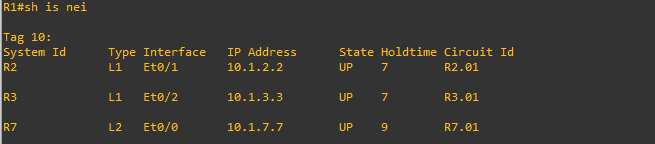
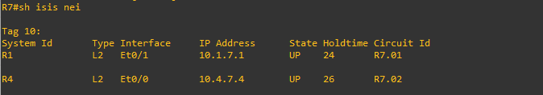
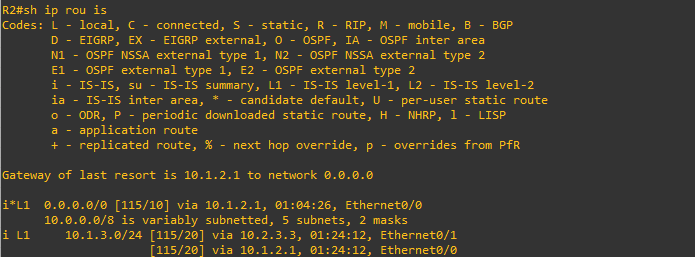
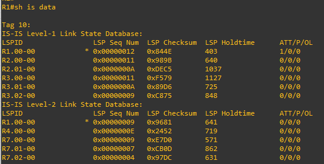

# Lab 08 — IS-IS (Intermediate System to Intermediate System)

**ENCOR v1.2 mapping:** ⚠️ **Out of syllabus** — IS-IS is not tested on the CCNP ENCOR 350-401 exam. Built for deeper understanding of link-state protocols, ISP/SP interview preparation, and comparison with OSPF.
**Status:** ✅ Complete — verified working

> **Why build this lab?** IS-IS is the backbone of most ISP and service provider networks. Understanding it strengthens OSPF knowledge (both use SPF/Dijkstra), prepares for CCNP SP or CCIE tracks, and is frequently asked in network engineer interviews — especially for ISP, telco, and data center roles.

---

## IS-IS vs OSPF — Key Differences

| Feature | OSPF | IS-IS |
|---------|------|-------|
| **Layer** | Layer 3 (runs over IP) | Layer 2 (runs directly over data link, CLNS) |
| **Area assignment** | Per interface | Per router (NET address) |
| **Backbone** | Area 0 (must exist, must be contiguous) | Level-2 backbone (no area number, formed by L2 and L1-L2 routers) |
| **Area border** | ABR (interfaces in multiple areas) | L1-L2 router (one area, bridges to L2 backbone) |
| **Address format** | IP addresses | NET address (AFI.Area.SystemID.NSEL) |
| **Dual-stack** | OSPFv2 (IPv4) + OSPFv3 (IPv6) = two processes | Single IS-IS process carries both IPv4 and IPv6 |
| **SPF algorithm** | Same (Dijkstra) | Same (Dijkstra) |
| **Adjacency needs matching subnet** | Yes | No — IS-IS runs at Layer 2, can form adjacency without matching IP |
| **Metric** | Cost (reference bandwidth / interface bandwidth) | Default 10 on all interfaces (use wide metrics for real values) |
| **Segment Routing** | Supported | Primary protocol for SR deployments in ISP/DC |

---

## How Hex Maps to Bytes (the foundation for reading NET addresses)

```
Binary:  0000 0000  0000 0000
         |── 8 bits ──|── 8 bits ──|
         = 1 byte       = 1 byte
         = 2 hex digits  = 2 hex digits
         Total: 16 bits = 2 bytes = 4 hex digits
```

Each group of **4 bits** (a nibble) maps to **one hex digit** using the 8-4-2-1 weight system:

```
         8  4  2  1
         ─  ─  ─  ─
         0  0  0  0  →  0
         0  0  0  1  →  1
         0  0  1  0  →  2
         0  0  1  1  →  3
         0  1  0  0  →  4
         0  1  0  1  →  5
         0  1  1  0  →  6
         0  1  1  1  →  7
         1  0  0  0  →  8
         1  0  0  1  →  9
         1  0  1  0  →  A (10)
         1  0  1  1  →  B (11)
         1  1  0  0  →  C (12)
         1  1  0  1  →  D (13)
         1  1  1  0  →  E (14)
         1  1  1  1  →  F (15)
```

**Example: the hex value `49` (AFI in IS-IS)**
```
  4        9
  ─        ─
 0100     1001
 8421     8421
 0+4+0+0  8+0+0+1
 = 4      = 9
 
 Combined: 0100 1001 = 8 bits = 1 byte
```

**So when you see `49.0200` in a NET address:**
- `49` = 2 hex digits = 1 byte (AFI)
- `0200` = 4 hex digits = 2 bytes (Area)
- Total = 3 bytes for AFI + Area

This is the only rule needed to read any NET address: **count the hex digits, divide by 2, that's your byte count.**

---

## NET Address — How to Read It

Every IS-IS router needs a NET (Network Entity Title) instead of a router-id:

```
49.0200.0000.0000.1111.00
├┤ ├──┤ ├──────────────┤ ├┤
AFI Area    System ID    NSEL

AFI  = 49 (1 byte) — private use, always 49
Area = 0200 (2 bytes) — this router is in area 0200
SysID = 0000.0000.1111 (6 bytes) — unique per router
NSEL = 00 (1 byte) — always 00 for a router (IS)
```

**2 hex digits = 1 byte.** `49` = 2 hex digits = 1 byte. `0200` = 4 hex digits = 2 bytes.

Routers in the same area share the same AFI + Area prefix. The System ID must be unique across the entire IS-IS domain.

| Router | NET | Area | System ID |
|--------|-----|:----:|-----------|
| R1 | 49.0200.0000.0000.1111.00 | 0200 | 1111 |
| R2 | 49.0200.0000.0000.2222.00 | 0200 | 2222 |
| R3 | 49.0200.0000.0000.3333.00 | 0200 | 3333 |
| R4 | 49.0100.0000.0000.4444.00 | 0100 | 4444 |
| R5 | 49.0100.0000.0000.5555.00 | 0100 | 5555 |
| R6 | 49.0100.0000.0000.6666.00 | 0100 | 6666 |
| R7 | 49.0010.0000.0000.7777.00 | 0010 | 7777 |

---

## IS-IS Levels (vs OSPF areas)

| IS-IS | OSPF equivalent | Role |
|-------|----------------|------|
| **Level-1** | Internal router | Stays within its area, knows only local routes + default to L1-L2 |
| **Level-2** | Backbone router | Inter-area only, carries routes between areas |
| **Level-1-2** (default) | ABR | Bridges its local area to the L2 backbone |

**`is-type`** sets the router-level ceiling. **`isis circuit-type`** restricts individual interfaces below that ceiling.

The backbone in IS-IS = all Level-2 and Level-1-2 routers, regardless of area. No "area 0" concept.

---

## IS-IS Adjacency Requirements

| # | Requirement | Notes |
|---|-------------|-------|
| 1 | IS-IS enabled on both routers | `router isis` + `ip router isis` on interface |
| 2 | Interfaces in the same area (same AFI+Area in NET) | For L1 adjacency only; L2 can be different areas |
| 3 | Matching level: L1↔L1, L2↔L2, or L1-L2↔either | L1 and L2 don't form adjacency with each other |
| 4 | System ID must be unique | Duplicate = LSDB corruption |
| 5 | Hello and Dead timers match | Default: Hello 10s, hold 30s |
| 6 | Authentication matches (if configured) | |
| 7 | MTU matches | IS-IS is sensitive to MTU — can cause adjacency drops |
| 8 | ~~Subnet match~~ — **NOT required** | IS-IS runs at Layer 2 (CLNS), can form adjacency without matching IP subnets |

That last point is a key difference from OSPF: IS-IS can form a neighbor relationship even if the interface IPs are on different subnets. The adjacency is at Layer 2 (using CLNS, not IP). However, IP routing still needs matching subnets to actually forward traffic.

---

## Topology

```
Area 0200 (Level-1)                L2 Backbone              Area 0100 (Level-1)
                                   (Area 0010)

[R2] ── e0/0 ── e0/1 ─┐                               ┌─ e0/1 ── e0/0 ── [R6]
                       │                               │
 e0/1                  [R1]── e0/0 ──e0/1 ──[R7]── e0/0 ──[R4]
                       │    L2-only        L2-only      │
[R3] ── e0/1 ── e0/2 ─┘                               └─ e0/2 ── e0/1 ── [R5]
 e0/0 ── e0/1 ── R2                                       e0/0 ── e0/1 ── R6


R1: L1-L2 (bridges area 0200 to backbone)
R7: L2-only (pure backbone transit)
R4: L1-L2 (bridges area 0100 to backbone)
R2, R3: L1-only (area 0200 internal)
R5, R6: L1-only (area 0100 internal)
```

## EVE-NG Topology



## Addressing

| Device | Interface | IP | IS-IS Level | Area |
|--------|-----------|------|:-----------:|:----:|
| R1 | e0/0 | 10.1.7.1/24 | L2 | 0200 |
| R1 | e0/1 | 10.1.2.1/24 | L1 | 0200 |
| R1 | e0/2 | 10.1.3.1/24 | L1 | 0200 |
| R2 | e0/0 | 10.1.2.2/24 | L1 | 0200 |
| R2 | e0/1 | 10.2.3.2/24 | L1 | 0200 |
| R3 | e0/0 | 10.2.3.3/24 | L1 | 0200 |
| R3 | e0/1 | 10.1.3.3/24 | L1 | 0200 |
| R7 | e0/0 | 10.4.7.7/24 | L2 | 0010 |
| R7 | e0/1 | 10.1.7.7/24 | L2 | 0010 |
| R4 | e0/0 | 10.4.7.4/24 | L2 | 0100 |
| R4 | e0/1 | 10.4.6.4/24 | L1 | 0100 |
| R4 | e0/2 | 10.4.5.4/24 | L1 | 0100 |
| R5 | e0/0 | 10.5.6.5/24 | L1 | 0100 |
| R5 | e0/1 | 10.4.5.5/24 | L1 | 0100 |
| R6 | e0/0 | 10.4.6.6/24 | L1 | 0100 |
| R6 | e0/1 | 10.5.6.6/24 | L1 | 0100 |

---

## Verification

```
! 1. Neighbors formed
R1# show isis neighbors
! Expect: R2 (L1), R3 (L1), R7 (L2)

```


```
R7# show isis neighbors
! Expect: R1 (L2), R4 (L2)
```


```
! 2. IS-IS routing table
R2# show ip route isis
! i L1  = Level-1 intra-area route
! i L2  = Level-2 inter-area route (from other areas via L1-L2 router)
```



```
! 3. IS-IS database
R1# show isis database
! L1 database: R1, R2, R3 (area 0200 routers)
! L2 database: R1, R7, R4 (backbone routers)
```

---

## Bugs Found During Build

| Router | Bug | Fix |
|--------|-----|-----|
| R1 (v1) | `is-type level-1` — ceiling too low for L2 adjacency with R7 | Changed to no `is-type` (defaults to L1-L2) |
| R1 (v2) | `is-type level-2-only` — overcorrected, now can't form L1 with R2/R3 | Removed `is-type` entirely (L1-L2 default) |
| R6 (v1) | System ID `5555` duplicated R5 | Changed to `6666` |
| R1↔R7 (v1) | Subnet mismatch: 10.1.7.0 vs 10.7.1.0 (octets transposed) | Standardized to 10.1.7.0/24 |
| R4↔R7 (v1) | Subnet mismatch: 10.4.7.0 vs 10.7.4.0 | Standardized to 10.4.7.0/24 |
| R4 (final) | e0/0 and e0/1 both 10.4.6.4 (duplicate IP) | e0/0 corrected to 10.4.7.4 (R7 link) |
| R6 (final) | Lo102 mask `255.255.255.25A5` (typo) | Corrected to 255.255.255.255 |

---

## Key Takeaways

- **IS-IS is out of ENCOR scope** but critical for ISP/SP careers and CCIE. Understanding it deepens OSPF knowledge since both use SPF.
- **`is-type` = router ceiling, `circuit-type` = per-interface restriction.** The interface can never exceed the router's capability.
- **L1-L2 is the default** and the most flexible — it's the IS-IS equivalent of an OSPF ABR.
- **IS-IS adjacency does NOT require matching subnets** (Layer 2 protocol) — this is a fundamental difference from OSPF.
- **NET address = AFI + Area + System ID + NSEL.** 2 hex digits = 1 byte. NSEL is always 00 for routers.
- **IS-IS metric defaults to 10 on every interface** — unlike OSPF which derives cost from bandwidth. Use `metric-style wide` for real-world deployments.
- **Duplicate System IDs corrupt the LSDB** — same impact as duplicate OSPF Router IDs but harder to detect.

Full device configs are in [`configs/`](configs/).
