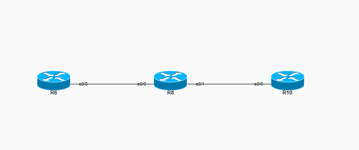
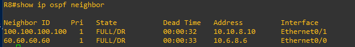
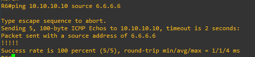
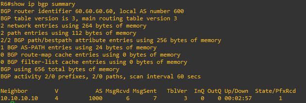
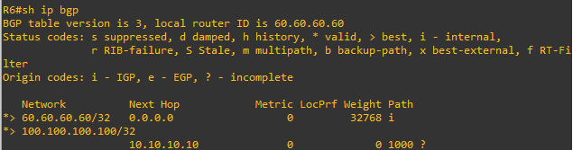
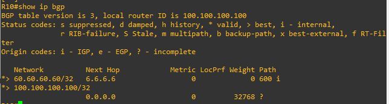

# Lab 10 — eBGP with Loopback Peering & Multihop

**ENCOR v1.2 mapping:** 3.0 Infrastructure — BGP fundamentals, eBGP peering, multihop, update-source, route advertisement
**Status:** ✅ Complete — verified working

## Objective

Establish an eBGP session between two routers (AS 600 and AS 1000) peering via **loopback addresses** across a transit router. Demonstrate two route advertisement methods: `network` command (R6) and `redistribute connected` with a route-map (R10).

---

## Topology

```
[R6]                    [R8]                    [R10]
AS 600              (transit only)             AS 1000
Lo0: 6.6.6.6         no BGP                  Lo0: 10.10.10.10
Lo100: 60.60.60.60                            Lo100: 100.100.100.100
   |                    |                        |
   e0/0 ──── 10.6.8.0/24 ──── e0/0    e0/1 ──── 10.10.8.0/24 ──── e0/0
                OSPF 100 area 0                    OSPF 100 area 0

         ╔══════════════════════════════════════╗
         ║  eBGP session (TCP 179)              ║
         ║  6.6.6.6 ←──── multihop ────→ 10.10.10.10  ║
         ║  AS 600                      AS 1000 ║
         ╚══════════════════════════════════════╝
```

## IOU Topology



## Addressing

| Device | Interface | IP | Protocol |
|--------|-----------|------|----------|
| R6 | e0/0 | 10.6.8.6/24 | OSPF 100 |
| R6 | Lo0 | 6.6.6.6/32 | BGP update-source |
| R6 | Lo100 | 60.60.60.60/32 | Advertised into BGP |
| R8 | e0/0 | 10.6.8.8/24 | OSPF 100 |
| R8 | e0/1 | 10.10.8.8/24 | OSPF 100 |
| R10 | e0/0 | 10.10.8.10/24 | OSPF 100 |
| R10 | Lo0 | 10.10.10.10/32 | BGP update-source |
| R10 | Lo100 | 100.100.100.100/32 | Redistributed into BGP |

---

## Why Loopback Peering + Multihop?

By default, eBGP peers using the **physical interface IP** of the directly connected link. If that one link goes down, the BGP session drops. Using **loopback peering**, the session stays up as long as any path exists between the two routers — exactly the same reason we use loopbacks for OSPF Router IDs and management access.

But loopbacks aren't directly connected, so eBGP (which defaults to TTL=1) can't reach them. That's what `ebgp-multihop` fixes — it increases the TTL so packets can cross transit routers.

The three commands that make this work:
```
neighbor X.X.X.X remote-as <AS>          ← who to peer with
neighbor X.X.X.X ebgp-multihop 6        ← allow up to 6 hops (TTL)
neighbor X.X.X.X update-source Loopback0 ← source BGP from loopback, not physical
```

Without `update-source`, BGP sources from the outgoing physical interface, and the peer rejects it (the TCP source IP doesn't match the configured neighbor address).

Without `ebgp-multihop`, the TTL=1 packet dies at the first hop (R8) and never reaches the peer.

---

## Two Ways to Advertise Routes into BGP

**Method 1: `network` command (R6)**
```
router bgp 600
 network 60.60.60.60 mask 255.255.255.255
```
Tells BGP: "If this exact prefix exists in my routing table, advertise it." The route must already be in the RIB (connected, static, or learned via IGP). The `network` command doesn't create the route — it only advertises it. The `mask` keyword is required in BGP (unlike OSPF/EIGRP).

**Method 2: `redistribute connected` with route-map (R10)**
```
ip prefix-list R10_loopback seq 100 permit 100.100.100.100/32

route-map R10_R6 permit 100
 match ip address prefix-list R10_loopback

router bgp 1000
 redistribute connected route-map R10_R6
```
Tells BGP: "Take connected routes that match the route-map and inject them." More flexible but riskier — a broad route-map can accidentally leak internal routes. The `network` command is safer because it's explicit.

---

## Verification

```
! 1. OSPF neighbors (R8 must see both R6 and R10)
R8# show ip ospf neighbor

```



```
! 2. Loopback reachability (must work BEFORE BGP can establish)
R6# ping 10.10.10.10 source 6.6.6.6

```


```

! 3. BGP session state
R6# show ip bgp summary
! PfxRcd should show a number (not Idle or Active)

```


```
! 4. BGP table (routes exchanged)
R6# show ip bgp
! Should see: 60.60.60.60/32 (local) and 100.100.100.100/32 (from R10)
```


```
R10# show ip bgp
! Should see: 100.100.100.100/32 (local) and 60.60.60.60/32 (from R6)
```

---

## The BGP Idle Troubleshooting Story

During this lab, BGP got stuck in **Idle state** on both routers, showing "Connections established 0" and "Last reset never" — even after fixing all reachability issues and running `clear ip bgp *`.

**What happened:**
1. I configured BGP neighbors before OSPF was working (R8 had a /32 mask on e0/1)
2. BGP tried TCP to the peer, failed, entered Idle with an exponential backoff timer
3. I fixed R8's mask, OSPF converged, pings started working
4. But BGP's backoff timer was stuck — `clear ip bgp *` didn't reset it on IOSv
5. Even `neighbor shutdown` / `no shutdown` didn't fix it

**The fix:** that I followed completely remove and rebuild BGP (**never do this in production or you will ☠️☠️☠️** ):
```
no router bgp 600
router bgp 600
 neighbor 10.10.10.10 remote-as 1000
 neighbor 10.10.10.10 ebgp-multihop 6
 neighbor 10.10.10.10 update-source Loopback0
 network 60.60.60.60 mask 255.255.255.255
```

**The lesson: always establish IGP reachability BEFORE configuring BGP.**
```
Step 1: Configure interfaces and IGP (OSPF)
Step 2: Verify ping loopback-to-loopback
Step 3: THEN configure BGP neighbors
```

---

## Bugs Found During Build

| # | Router | Bug | Fix |
|---|--------|-----|-----|
| 1 | **R8** | e0/1 mask /32 instead of /24 | Changed to 255.255.255.0 |
| 2 | **R10** | Prefix-list `100.100.100.0/24` didn't match connected route `100.100.100.100/32` | Changed to `100.100.100.100/32` |
| 3 | **Both** | BGP stuck in Idle (backoff timer, IOSv quirk) | `no router bgp` + rebuild |

---

## Key Takeaways

- **BGP uses TCP port 179** — it's a TCP-based protocol, not multicast like OSPF (224.0.0.5) or hello-based like EIGRP.
- **BGP uses triggered and incremental updates** — only sends changes, not the full table periodically.
- **eBGP loopback peering needs three commands:** `remote-as`, `ebgp-multihop`, `update-source`.
- **`network` is safer than `redistribute`** for BGP route advertisement — explicit vs broad.
- **"Active" state in BGP = trying to connect but failing.** "Idle" = not even trying. Both mean the session is down, but the troubleshooting is different.
- **Build order matters:** IGP first → verify reachability → BGP last. Configuring BGP before reachability exists can cause stuck Idle states.
- **eBGP loop prevention:** BGP drops any route whose AS-PATH contains its own ASN. If AS 100 receives a route with AS-PATH {200, 100, 300}, it rejects it — the route has already passed through AS 100.

Full device configs are in [`configs/`](configs/).
