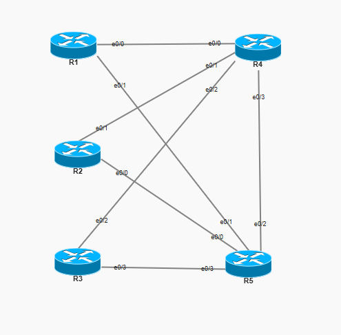
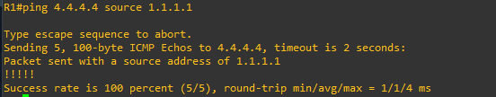
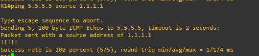
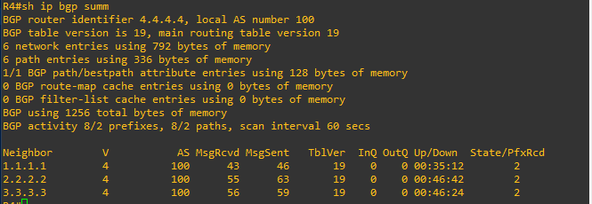
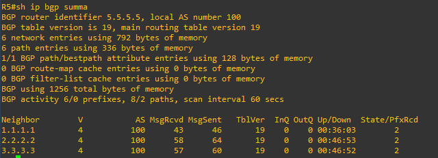
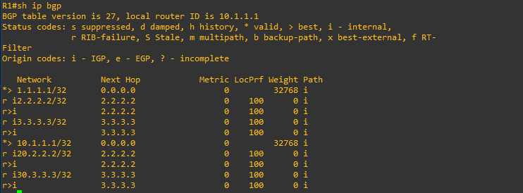
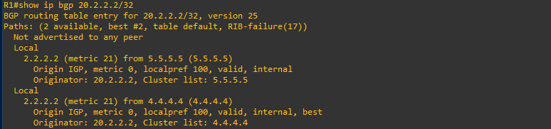
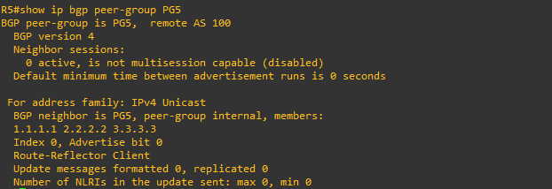

# Lab 11 — iBGP with Dual Route Reflectors

**ENCOR v1.2 mapping:** 3.0 Infrastructure — iBGP, route reflector, peer-group, BGP split-horizon
**Status:** ✅ Complete — verified working

## Objective

Build an iBGP network within AS 100 using **two Route Reflectors** (R4 and R5) to solve the iBGP split-horizon problem. Prove that routes advertised by one client are reflected to all other clients without requiring full-mesh peering. Demonstrate **peer-groups** on R5 for cleaner configuration.

---

## The Problem Route Reflectors Solve

iBGP has a **split-horizon rule:** a route learned from an iBGP peer is NOT advertised to another iBGP peer. This prevents loops but creates a scaling problem:

```
Without RR (5 routers = 10 iBGP sessions needed):
  R1 <-> R2, R1 <-> R3, R1 <-> R4, R1 <-> R5
  R2 <-> R3, R2 <-> R4, R2 <-> R5
  R3 <-> R4, R3 <-> R5
  R4 <-> R5
  Formula: n(n-1)/2 = 5(4)/2 = 10 sessions

With RR (5 routers = 6 iBGP sessions):
  R1 -> R4 (RR), R1 -> R5 (RR)
  R2 -> R4,      R2 -> R5
  R3 -> R4,      R3 -> R5
  Clients only peer with RRs, not with each other.
```

The RR **reflects** routes from one client to all other clients, bypassing the split-horizon rule. The clients don't even know they're talking to an RR — they just see iBGP routes appearing.

---

## Topology

```
                     [ R4 ] RR #1
                   /    |
                 /      |  (10.4.5.0/24)
               /        |
  [ R1 ] ----    [ R5 ] RR #2   ---- [ R3 ]
    |    \      / |  \                   |
    |      \  /   |    \                 |
    |       \/    |     \                |
    |       /\    |      \               |
    |     /    \  |       \              |
  [ R2 ] ----   peer-group RR2

  All in AS 100.  OSPF 100 area 0 for reachability.
  R1, R2, R3 = RR clients (peer with both R4 and R5)
  R4 = RR #1 (individual neighbor statements)
  R5 = RR #2 (peer-group for cleaner config)
```

## IOU Topology



## Addressing

| Device | Interface | IP | Connects to |
|--------|-----------|------|-------------|
| R1 | e0/0 | 10.1.4.1/24 | R4 |
| R1 | e0/1 | 10.1.5.1/24 | R5 |
| R1 | Lo0 | 1.1.1.1/32 | BGP source |
| R1 | Lo100 | 10.1.1.1/32 | Advertised into BGP |
| R2 | e0/0 | 10.2.5.2/24 | R5 |
| R2 | e0/1 | 10.2.4.2/24 | R4 |
| R2 | Lo0 | 2.2.2.2/32 | BGP source |
| R2 | Lo100 | 20.2.2.2/32 | Advertised into BGP |
| R3 | e0/2 | 10.3.4.3/24 | R4 |
| R3 | e0/3 | 10.3.5.3/24 | R5 |
| R3 | Lo0 | 3.3.3.3/32 | BGP source |
| R3 | Lo100 | 30.3.3.3/32 | Advertised into BGP |
| R4 | e0/0 | 10.1.4.4/24 | R1 |
| R4 | e0/1 | 10.4.5.4/24 | R5 |
| R4 | e0/2 | 10.2.4.4/24 | R2 |
| R4 | Lo0 | 4.4.4.4/32 | BGP source |
| R5 | e0/0 | 10.2.5.5/24 | R2 |
| R5 | e0/1 | 10.1.5.5/24 | R1 |
| R5 | e0/2 | 10.4.5.5/24 | R4 |
| R5 | e0/3 | 10.3.5.5/24 | R3 |
| R5 | Lo0 | 5.5.5.5/32 | BGP source |

---

## Peer-Group (R5) vs Individual Statements (R4)

R4 uses individual neighbor commands — one block per client:
```
neighbor 1.1.1.1 remote-as 100
neighbor 1.1.1.1 update-source Loopback0
neighbor 1.1.1.1 route-reflector-client
! repeat for R2, R3...
```

R5 uses a **peer-group** — define settings once, apply to all:
```
neighbor RR2 peer-group
neighbor RR2 remote-as 100
neighbor RR2 update-source Loopback0
neighbor RR2 route-reflector-client

neighbor 1.1.1.1 peer-group RR2
neighbor 2.2.2.2 peer-group RR2
neighbor 3.3.3.3 peer-group RR2
```

Both achieve the same result. Peer-groups are cleaner when many neighbors share identical settings — change one line in the peer-group and it applies to all members. With 3 clients the difference is small; with 50 clients, peer-groups are essential.

---

## Why Dual Route Reflectors?

If R4 (single RR) goes down, all clients lose their iBGP routes — single point of failure. With R4 AND R5 as RRs, each client peers with both. If one RR fails, routes are still reflected by the other. Every client has `neighbor 4.4.4.4` and `neighbor 5.5.5.5` for redundancy.

---

## Verification

```
! 1. OSPF reachability (foundation for iBGP)
R1# ping 4.4.4.4 source 1.1.1.1
R1# ping 5.5.5.5 source 1.1.1.1
```




```
! 2. BGP sessions established
R4# show ip bgp summary
! 1.1.1.1, 2.2.2.2, 3.3.3.3 should all show Established (PfxRcd = number)
```



```
R5# show ip bgp summary
! Same — all three clients Established
```



```
! 3. Route reflection working (the key test)
R1# show ip bgp
! Should see:
!   10.1.1.1/32 (local)
!   20.2.2.2/32 (from R2, reflected by R4 and/or R5)
!   30.3.3.3/32 (from R3, reflected by R4 and/or R5)
!   3.3.3.3/32  (from R3)
```


```
! 4. Verify the route was reflected, not directly learned
R1# show ip bgp 20.2.2.2/32
! Originator: 2.2.2.2 (R2 originated it)
! Cluster-list: 4.4.4.4 (or 5.5.5.5) — proves RR reflected it
```


```
! 5. Peer-group verification on R5
R5# show ip bgp peer-group RR2
! Shows all members and their shared settings
```

---

## Bugs Found During Build

| # | Router | Bug | Fix |
|---|--------|-----|-----|
| 1 | R1/R2/R3 | `neighbour` (British) instead of `neighbor` | IOS only accepts American spelling |
| 2 | R5 (v1) | Loopback0 = 4.4.4.4 (duplicate of R4) | Changed to 5.5.5.5 |
| 3 | R4↔R5 (v1) | Subnet mismatch (10.4.4.0 vs 10.4.5.0) | R4 e0/1 changed to 10.4.5.4 |
| 4 | R5 (v2) | Peer-group AND individual statements mixed (conflicting) | Use peer-group only |
| 5 | R4 e0/2 | Was 10.2.3.0/24 (orphaned) | Changed to 10.2.4.0/24 (matches R2) |

---

## Key Takeaways

- **iBGP split-horizon:** routes learned from an iBGP peer are NOT forwarded to another iBGP peer. Without RR or full-mesh, routes are invisible between clients.
- **Route Reflector bypasses split-horizon** by reflecting client routes to all other clients. Clients don't need to peer with each other.
- **Dual RRs for redundancy** — every client peers with both. Single RR = single point of failure.
- **Peer-groups save config lines** — define settings once, apply to all members. Essential at scale.
- **`neighbour` vs `neighbor`** — IOS is American English only. British spelling is silently rejected with no error. Use Tab-completion (`nei` + Tab) to avoid this.
- **OSPF is the foundation** — iBGP peers via loopbacks, and OSPF provides the reachability. No OSPF = no iBGP. Always build IGP first.
- **`route-reflector-client` goes on the RR, not the client.** R4 and R5 mark R1/R2/R3 as clients. R1/R2/R3 have no idea they're RR clients — their config is standard iBGP.

Full device configs are in [`configs/`](configs/).
