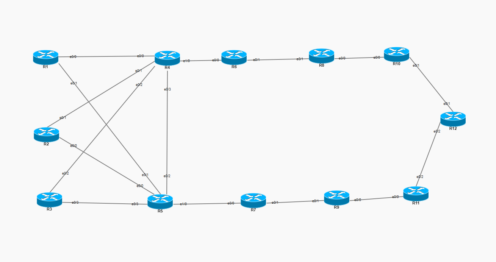
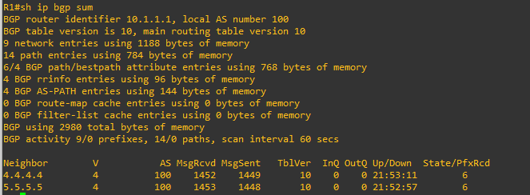
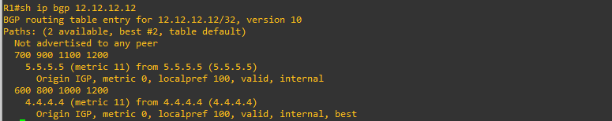
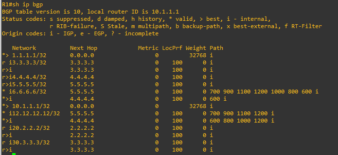
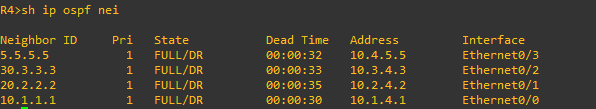
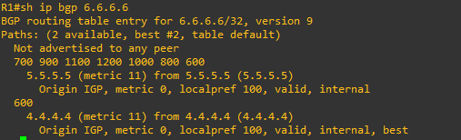
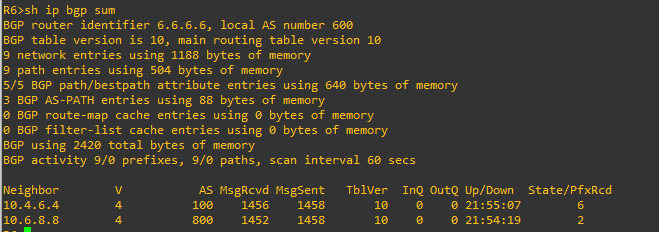
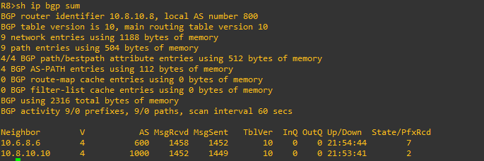
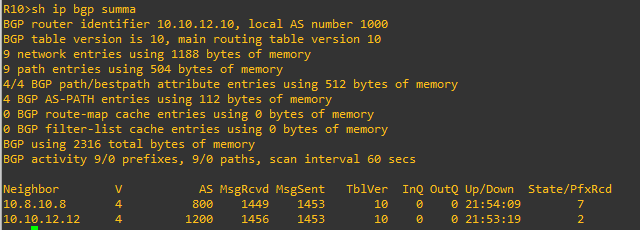

# Lab 12 - eBGP + iBGP Combined (12 Routers)

**CCNP ENCOR Domain:** 3.0 Infrastructure (25%)
**Topics:** eBGP, iBGP, Route Reflectors, Peer-Groups, OSPF as IGP Underlay, next-hop-self, AS-PATH

---

## Topology

```
                        AS 100 (iBGP Core)
              +-------+-------+-------+-------+
              |       |       |       |       |
            [R1]   [R2]    [R3]    [R4-RR]  [R5-RR]
           Lo0:    Lo0:   Lo0:    Lo0:      Lo0:
          1.1.1.1 2.2.2.2 3.3.3.3 4.4.4.4  5.5.5.5

    R1 e0/0 --- e0/0 R4     R1 e0/1 --- e0/1 R5
    R2 e0/1 --- e0/1 R4     R2 e0/0 --- e0/0 R5
    R3 e0/2 --- e0/2 R4     R3 e0/3 --- e0/3 R5
                             R4 e0/3 --- e0/2 R5

    iBGP clients (R1,R2,R3) peer to both RRs via Loopback 0
    R4 and R5 use peer-group RR2 with route-reflector-client + next-hop-self

                  Top Chain (eBGP)               Bottom Chain (eBGP)
    R4 e1/0 --- e0/0 R6 (AS 600)      R5 e1/0 --- e0/0 R7 (AS 700)
    R6 e0/1 --- e0/1 R8 (AS 800)      R7 e0/1 --- e0/1 R9 (AS 900)
    R8 e0/0 --- e0/0 R10 (AS 1000)    R9 e0/0 --- e0/0 R11 (AS 1100)
    R10 e0/1 --- e0/1 R12 (AS 1200)   R11 e0/2 --- e0/2 R12 (AS 1200)

    Both chains converge at R12 (AS 1200)
    R12 advertises 12.12.12.12/32 via Loopback 100
```
## IOU Web Topology



---

## Objectives

1. Build an iBGP core (AS 100) with dual Route Reflectors (R4, R5) using peer-groups
2. Configure eBGP peering between AS 100 and external ASes using physical interface IPs
3. Create two parallel eBGP chains that converge at R12 (AS 1200)
4. Use OSPF process 100 as the IGP underlay so iBGP peers can reach each other's loopbacks
5. Apply next-hop-self on Route Reflectors so iBGP clients can reach external prefixes
6. Verify end-to-end BGP reachability - R1/R2/R3 should see R12's prefix via two AS-PATHs

---

## Router Table

| Router | AS | Role | Interfaces | Loopback 0 | Notes |
|--------|------|------|------------|------------|-------|
| R1 | 100 | iBGP Client | e0/0 (10.1.4.1), e0/1 (10.1.5.1) | 1.1.1.1 | Lo100: 10.1.1.1 |
| R2 | 100 | iBGP Client | e0/1 (10.2.4.2), e0/0 (10.2.5.2) | 2.2.2.2 | Lo100: 20.2.2.2 |
| R3 | 100 | iBGP Client | e0/2 (10.3.4.3), e0/3 (10.3.5.3) | 3.3.3.3 | Lo100: 30.3.3.3 |
| R4 | 100 | Route Reflector | e0/0-e0/3, e1/0 (10.4.6.4) | 4.4.4.4 | Peer-group RR2, eBGP to R6 |
| R5 | 100 | Route Reflector | e0/0-e0/3, e1/0 (10.5.7.5) | 5.5.5.5 | Peer-group RR2, eBGP to R7 |
| R6 | 600 | eBGP Transit | e0/0 (10.4.6.6), e0/1 (10.6.8.6) | 6.6.6.6 | Top chain |
| R7 | 700 | eBGP Transit | e0/0 (10.5.7.7), e0/1 (10.7.9.7) | 7.7.7.7 | Bottom chain |
| R8 | 800 | eBGP Transit | e0/1 (10.6.8.8), e0/0 (10.8.10.8) | - | Top chain |
| R9 | 900 | eBGP Transit | e0/1 (10.7.9.9), e0/0 (10.9.11.9) | - | Bottom chain |
| R10 | 1000 | eBGP Transit | e0/0 (10.8.10.10), e0/1 (10.10.12.10) | - | Top chain |
| R11 | 1100 | eBGP Transit | e0/0 (10.9.11.11), e0/2 (10.11.12.11) | - | Bottom chain, uses e0/2 |
| R12 | 1200 | Destination | e0/1 (10.10.12.12), e0/2 (10.11.12.12) | - | Lo100: 12.12.12.12 |

---

## Config Highlights

### iBGP with Dual Route Reflectors (R4, R5)

R4 and R5 both use peer-group RR2 to manage iBGP sessions with R1, R2, R3:

```
router bgp 100
 neighbor RR2 peer-group
 neighbor RR2 remote-as 100
 neighbor RR2 update-source loopback 0
 neighbor RR2 route-reflector-client
 neighbor RR2 next-hop-self
 neighbor 1.1.1.1 peer-group RR2
 neighbor 2.2.2.2 peer-group RR2
 neighbor 3.3.3.3 peer-group RR2
```

Key points:
- `update-source loopback 0` - iBGP peers via loopback for stability
- `route-reflector-client` on peer-group - all clients inherit RR behavior
- `next-hop-self` on peer-group - RR rewrites next-hop so clients can reach external prefixes

### OSPF as IGP Underlay

All AS 100 routers (R1-R5) run OSPF process 100 with `network 0.0.0.0 0.0.0.0 area 0` to ensure loopback reachability for iBGP peering.

### eBGP Peering with Physical IPs

eBGP neighbors use directly connected physical interface IPs (not loopbacks):

```
! R4 to R6
neighbor 10.4.6.6 remote-as 600

! R5 to R7
neighbor 10.5.7.7 remote-as 700
```

### iBGP Client Configuration (R1-R3)

Each client peers to both Route Reflectors via loopback:

```
router bgp 100
 neighbor 4.4.4.4 remote-as 100
 neighbor 4.4.4.4 update-source loopback 0
 neighbor 5.5.5.5 remote-as 100
 neighbor 5.5.5.5 update-source loopback 0
```

---

## Verification Commands

### 1. Check BGP neighbor status on R1

```
R1# show ip bgp summary
```

Expected: R1 should show two iBGP neighbors (4.4.4.4 and 5.5.5.5) in Established state with prefixes received.

### 2. Check Route Reflector clients on R4

```
R4# show ip bgp summary
```



Expected: R4 should show iBGP neighbors 1.1.1.1, 2.2.2.2, 3.3.3.3 (clients) and eBGP neighbor 10.4.6.6 (R6) all Established.

### 3. Verify R12's prefix reaches R1 via two paths

```
R1# show ip bgp 12.12.12.12
```


Expected: Two paths to 12.12.12.12/32:
- Path 1 (via R4): AS-PATH 600 800 1000 1200 (top chain)
- Path 2 (via R5): AS-PATH 700 900 1100 1200 (bottom chain)

### 4. Check AS-PATH on R1's BGP table

```
R1# show ip bgp
```


Expected: R12's prefix 12.12.12.12/32 appears with two entries showing different AS-PATHs from each chain.

### 5. Verify OSPF adjacencies in AS 100

```
R4# show ip ospf neighbor
```


Expected: R4 should show OSPF neighbors with R1, R2, R3, and R5.

### 6. Check next-hop rewriting on Route Reflector

```
R1# show ip bgp 6.6.6.6
```


Expected: Next-hop should be 4.4.4.4 (R4's loopback) instead of 10.4.6.6 (R6's physical IP), confirming next-hop-self is working.

### 7. Verify eBGP chain connectivity

```
R6# show ip bgp summary
R8# show ip bgp summary
R10# show ip bgp summary
```






Expected: Each transit router shows two eBGP neighbors in Established state.

---

## Troubleshooting - Bugs Found and Fixed

### Bug 1: R4 eBGP peering used loopback instead of physical IP

**Symptom:** R4-R6 eBGP session stuck in Active state

**Root Cause:** R4 had `neighbor 6.6.6.6 remote-as 600` (R6's loopback). eBGP requires directly connected physical IPs by default - R6's loopback is not reachable without an IGP between the two ASes.

**Fix:** Changed to `neighbor 10.4.6.6 remote-as 600` (physical IP on the shared link).

### Bug 2: R7 had wrong remote-as for R5

**Symptom:** R5-R7 eBGP session stuck in Active/OpenSent

**Root Cause:** R7 had `neighbor 10.5.7.5 remote-as 500` instead of `remote-as 100`. AS 500 does not exist - R5 is in AS 100.

**Fix:** Changed to `neighbor 10.5.7.5 remote-as 100`.

### Bug 3: R12 missing network statement

**Symptom:** R12's loopback 12.12.12.12/32 not appearing in BGP table anywhere

**Root Cause:** R12's BGP config had no `network` statement, so the prefix was never advertised.

**Fix:** Added `network 12.12.12.12 mask 255.255.255.255` under `router bgp 1200`.

### Bug 4: next-hop-self applied to individual neighbor instead of peer-group

**Symptom:** iBGP clients could not reach external prefixes - BGP table showed next-hop as R6/R7's physical IP which clients had no route to.

**Root Cause:** On R4 and R5, `next-hop-self` was applied to only one individual neighbor (`neighbor 1.1.1.1 next-hop-self`) instead of the peer-group. Only R1 would get rewritten next-hops; R2 and R3 would not.

**Fix:** Applied `neighbor RR2 next-hop-self` on the peer-group so all clients get rewritten next-hops.

### Bug 5: R11 used wrong interface for R12 link

**Symptom:** R11-R12 eBGP session would not come up

**Root Cause:** R11 had the 10.11.12.11 address configured on e0/1, but the physical cable in the EVE-NG topology connected e0/2 to R12.

**Fix:** Changed from `int e0/1` to `int e0/2` for the 10.11.12.0/24 subnet on R11.

---

## Design Decisions

- **Dual Route Reflectors** - R4 and R5 both reflect to the same clients (R1-R3) for redundancy. If one RR goes down, clients still receive external routes via the other.
- **Peer-groups** - Simplifies RR config. Instead of configuring route-reflector-client, update-source, and next-hop-self per neighbor, it is applied once on the peer-group.
- **Two parallel eBGP chains** - Creates path diversity. R1-R3 see R12's prefix via two different AS-PATHs, allowing BGP best-path selection.
- **OSPF area 0 everywhere** - Simple single-area OSPF underlay. The purpose is only loopback reachability for iBGP, not complex OSPF design.
- **No loopback peering for eBGP** - eBGP uses physical IPs because there is no IGP between different ASes to resolve loopback addresses.

---

## ENCOR Exam Relevance

| Topic | ENCOR Weight | What This Lab Covers |
|-------|-------------|---------------------|
| BGP path selection | 3.0 Infrastructure | Two paths to R12 - best path chosen by shortest AS-PATH or first received |
| iBGP vs eBGP rules | 3.0 Infrastructure | iBGP needs update-source + RR or full mesh; eBGP uses physical IPs |
| Route Reflectors | 3.0 Infrastructure | Dual RR design, peer-groups, route-reflector-client |
| next-hop-self | 3.0 Infrastructure | Why RRs must rewrite next-hop for iBGP clients |
| OSPF as IGP underlay | 3.0 Infrastructure | iBGP depends on IGP for loopback reachability |
| BGP peer-groups | 3.0 Infrastructure | Scalable iBGP config on Route Reflectors |
| AS-PATH attribute | 3.0 Infrastructure | Visible in show ip bgp - traces the path through external ASes |

---

## Files

```
lab-12-ebgp-ibgp-combined/
  README.md
  configs/
    R1.txt
    R2.txt
    R3.txt
    R4.txt
    R5.txt
    R6.txt
    R7.txt
    R8.txt
    R9.txt
    R10.txt
    R11.txt
    R12.txt
```
